# Outputs Description

This document explains the figures and videos generated by the Formula 1 analysis pipeline. Static figures are stored in `outputs/figures/`; videos are stored in `outputs/videos/`.

## Static Figures

All report-oriented static figures exclude 2026 data. Modern figures use 2019-2025 data, while historical figures use the SQLite historical dataset.

### Dataset and Historical Background

#### [`yearly_records_2019_2025.png`](figures/yearly_records_2019_2025.png)

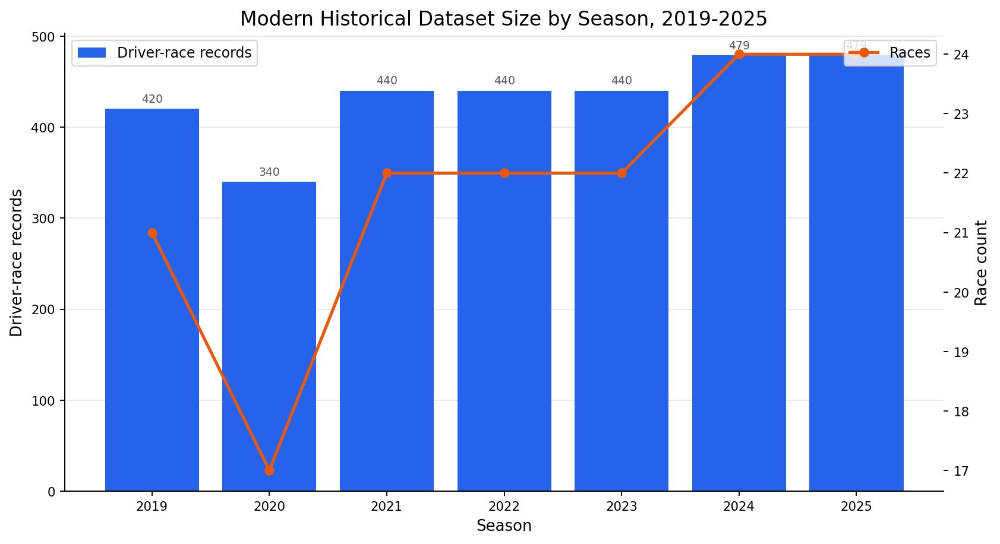

Shows the number of driver-race records and race count in each modern season from 2019 to 2025. It explains the scale and year coverage of the modern analysis dataset.

Use in report: dataset description.

#### [`historical_races_by_year.png`](figures/historical_races_by_year.png)

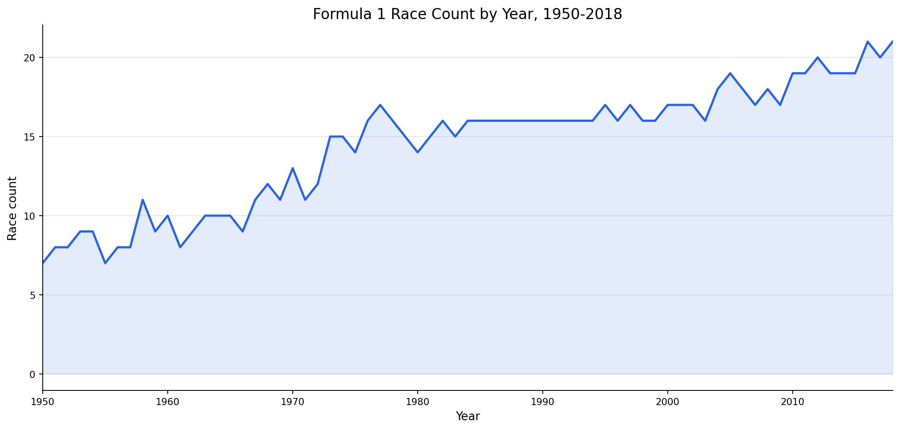

Shows how the Formula 1 calendar expanded from 1950 to 2018. It provides historical background and shows that the sport has grown from a small calendar to a larger global championship.

Use in report: case background.

#### [`historical_top10_driver_wins.png`](figures/historical_top10_driver_wins.png)

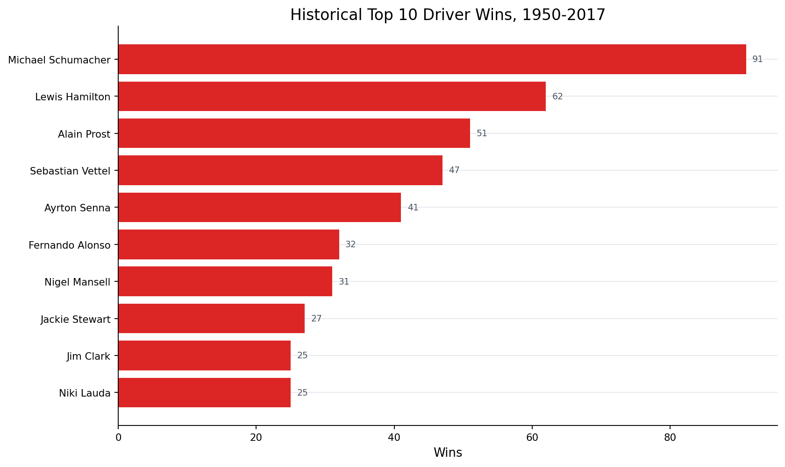

Ranks the top 10 race-winning drivers in the historical SQLite data. It identifies historically dominant drivers such as Michael Schumacher, Lewis Hamilton, Alain Prost, Sebastian Vettel, and Ayrton Senna.

Use in report: case background and historical context.

#### [`historical_top10_constructor_wins.png`](figures/historical_top10_constructor_wins.png)

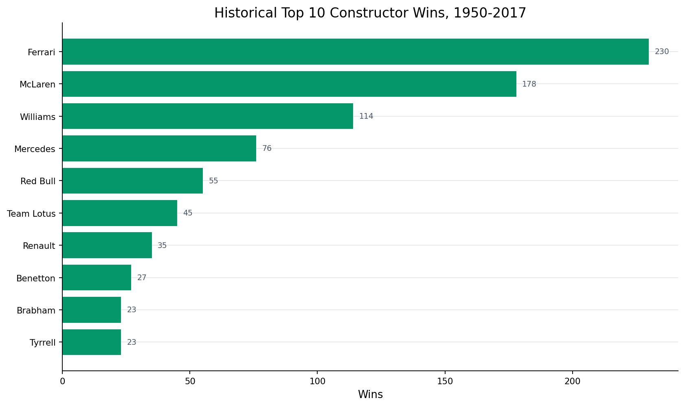

Ranks the top 10 race-winning constructors in the historical SQLite data. It highlights long-term constructor dominance, especially Ferrari, McLaren, Williams, Mercedes, and Red Bull.

Use in report: case background and historical context.

## Grid, Qualifying, and Race Result Analysis

#### [`grid_position_outcome_rates.png`](figures/grid_position_outcome_rates.png)

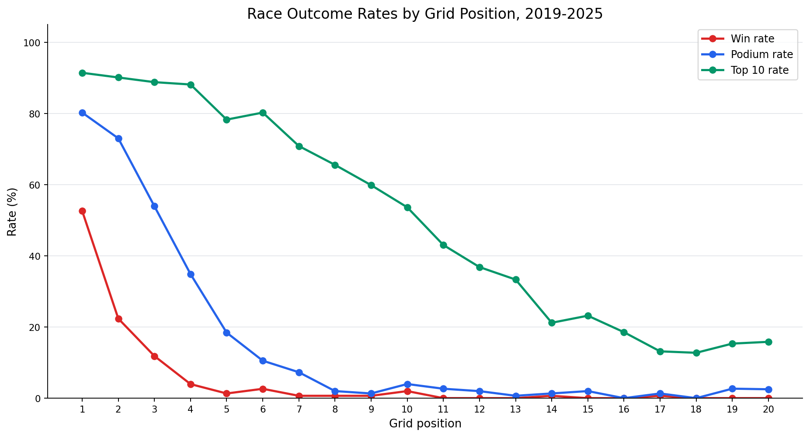

Compares win rate, podium rate, and top-10 rate by starting grid position for 2019-2025. It shows that better starting positions generally lead to better race outcomes.

Use in report: analysis of starting grid influence.

#### [`qualifying_position_outcome_rates.png`](figures/qualifying_position_outcome_rates.png)

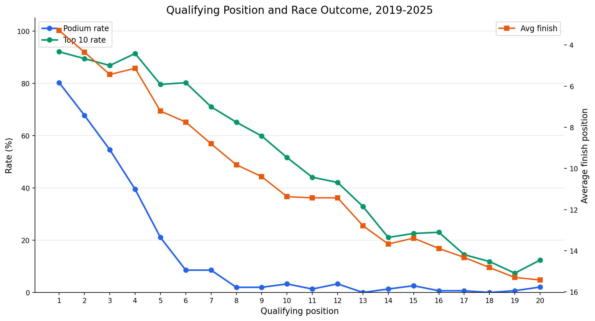

Shows how qualifying position relates to podium rate, top-10 rate, and average finish position. It demonstrates the predictive value of qualifying performance.

Use in report: analysis of qualifying influence.

#### [`qualifying_finish_heatmap_2019_2025.png`](figures/qualifying_finish_heatmap_2019_2025.png)

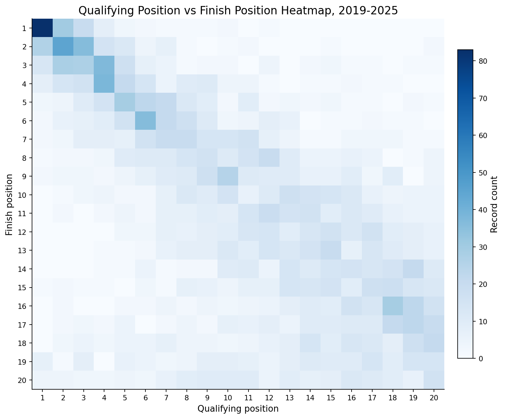

Displays the joint distribution of qualifying position and finish position. Darker cells indicate more frequent combinations. This is more informative than a simple average because it shows the full distribution of race outcomes.

Use in report: technical analysis of qualifying-to-race relationship.

#### [`grid_advantage_historical_vs_modern.png`](figures/grid_advantage_historical_vs_modern.png)

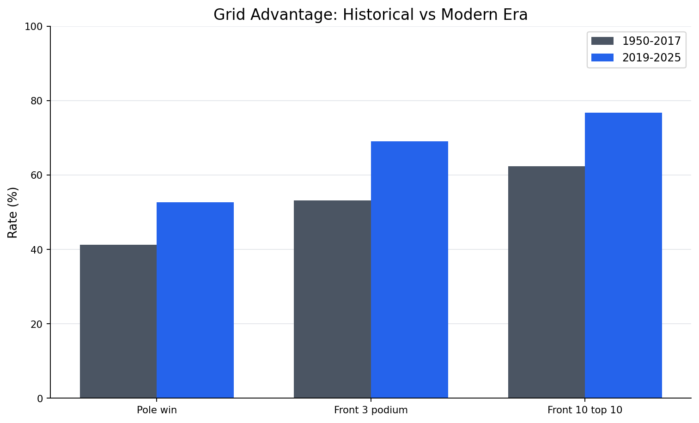

Compares historical and modern grid advantage using pole win rate, front-3 podium rate, and front-10 top-10 rate. It shows whether starting position has become more or less important in the modern era.

Use in report: historical-modern comparison.

#### [`position_change_distribution_2019_2025.png`](figures/position_change_distribution_2019_2025.png)

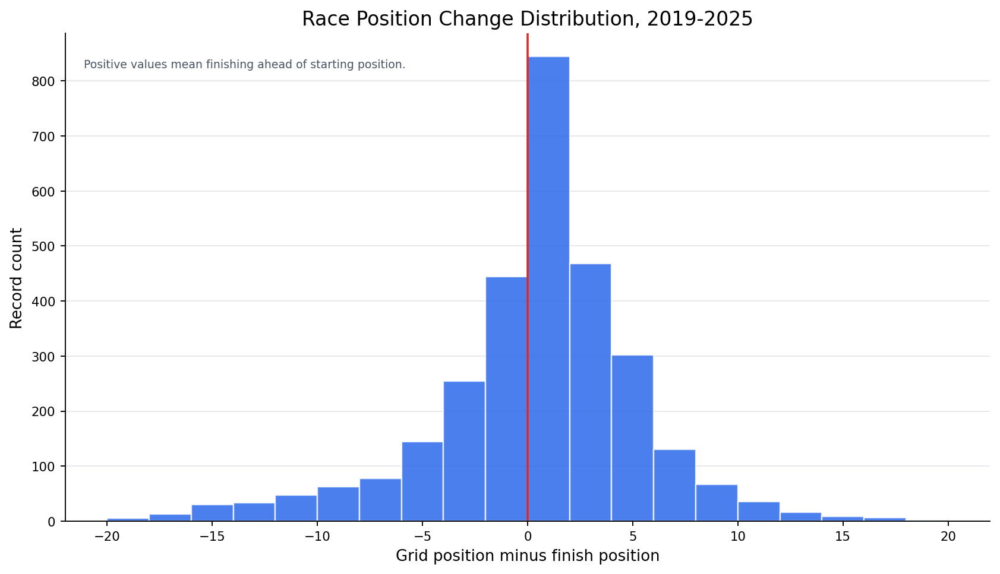

Shows how often drivers gained or lost positions relative to their grid starts. Positive values mean a driver finished ahead of the starting position.

Use in report: race position-change analysis.

## Driver Analysis

#### [`top10_driver_points_2019_2025.png`](figures/top10_driver_points_2019_2025.png)

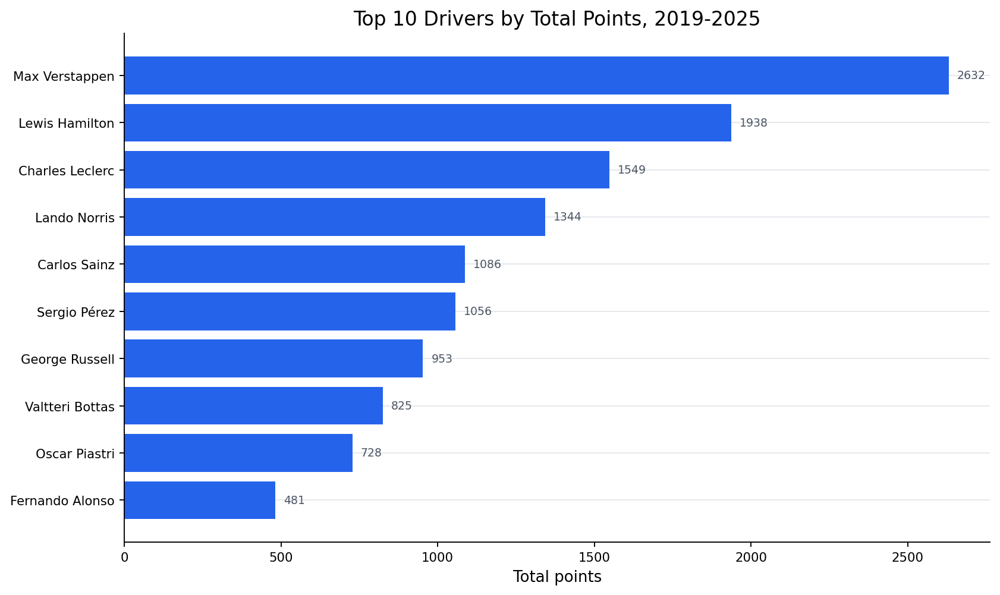

Ranks the top 10 drivers by total points from 2019 to 2025. It gives a direct view of modern driver performance.

Use in report: driver performance overview.

#### [`driver_points_trend_top6.png`](figures/driver_points_trend_top6.png)

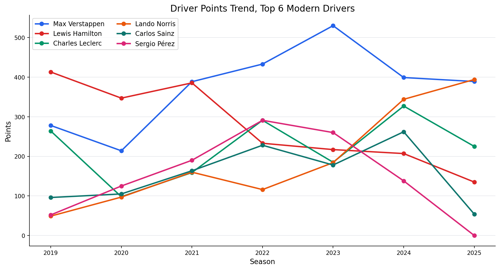

Shows season-by-season points for the top modern drivers. It helps identify changes in driver form and dominance over time.

Use in report: driver trend analysis.

#### [`driver_points_heatmap_top10.png`](figures/driver_points_heatmap_top10.png)

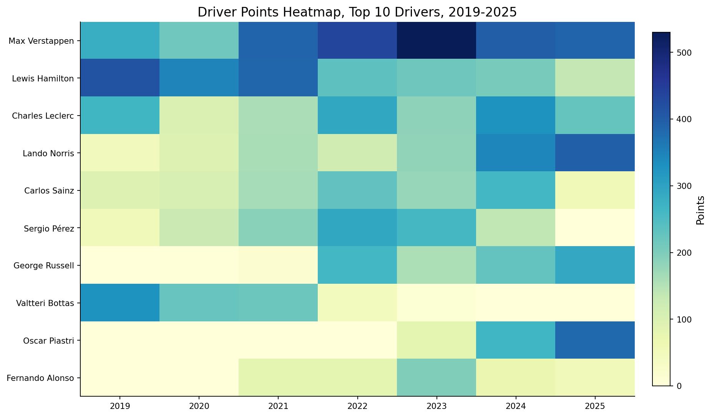

Shows year-by-year points for the top 10 drivers as a heatmap. It makes it easier to compare multiple drivers and seasons in one compact figure.

Use in report: driver trend comparison.

#### [`driver_podiums_wins_2019_2025.png`](figures/driver_podiums_wins_2019_2025.png)

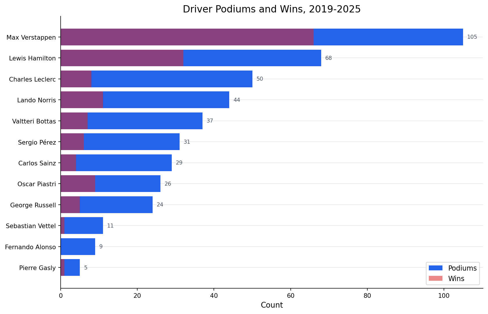

Compares podium counts and wins by driver. It separates consistent podium performance from race-winning ability.

Use in report: driver achievement analysis.

#### [`driver_consistency_scatter_2019_2025.png`](figures/driver_consistency_scatter_2019_2025.png)

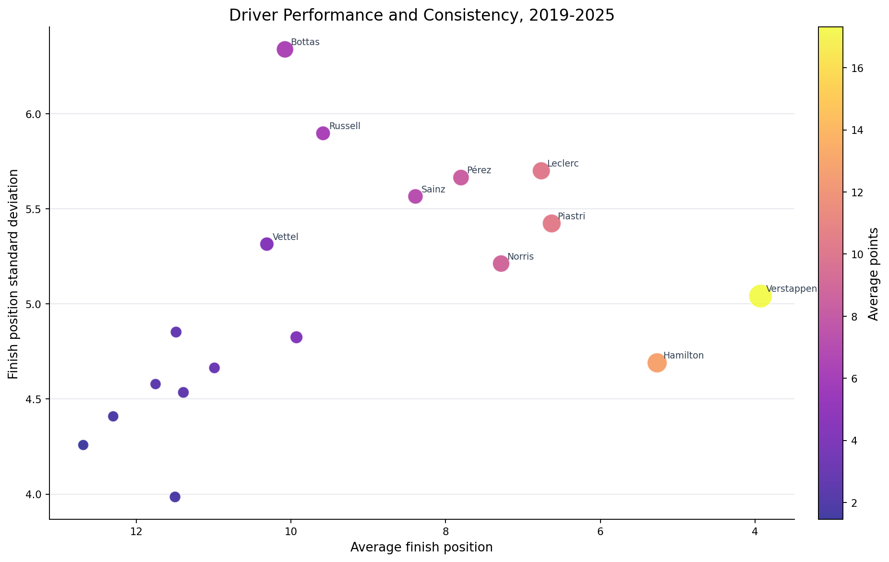

Compares drivers by average finish position, finish-position variability, podium rate, and average points. It reflects both performance level and stability.

Use in report: driver stability and consistency analysis.

#### [`top_driver_position_gain_2019_2025.png`](figures/top_driver_position_gain_2019_2025.png)

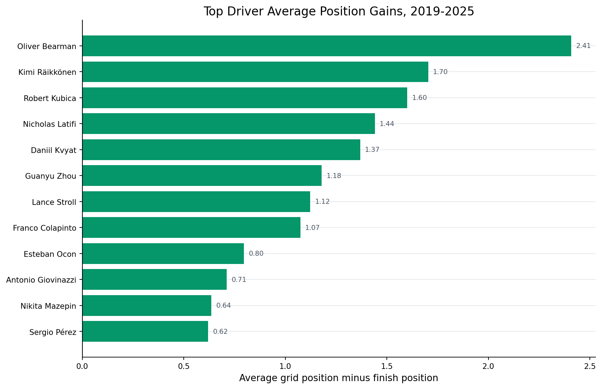

Ranks drivers by average position gain from grid to finish. It identifies drivers who tend to improve their race position after the start.

Use in report: racecraft and position-gain analysis.

## Constructor Analysis

#### [`constructor_points_2019_2025.png`](figures/constructor_points_2019_2025.png)

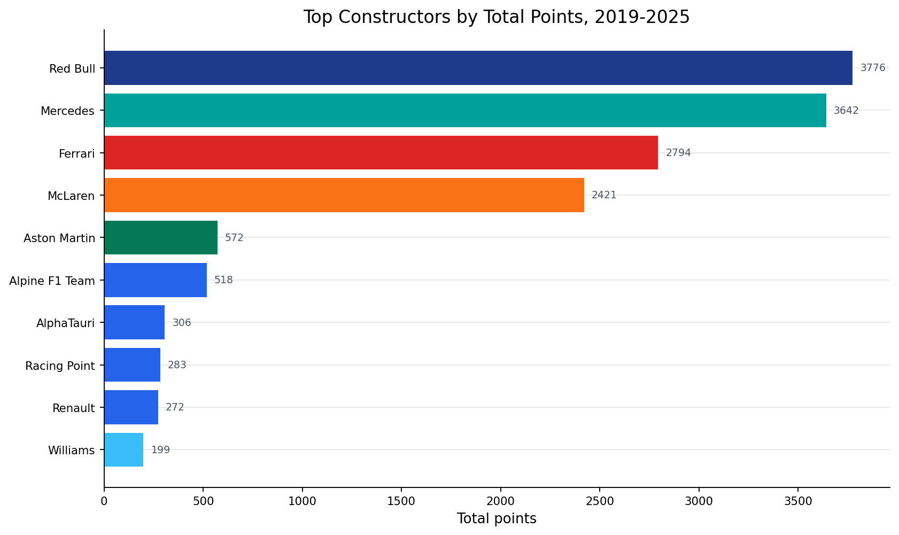

Ranks constructors by total points from 2019 to 2025. It summarizes the main competitive order among teams.

Use in report: constructor performance overview.

#### [`constructor_points_trend_top6.png`](figures/constructor_points_trend_top6.png)

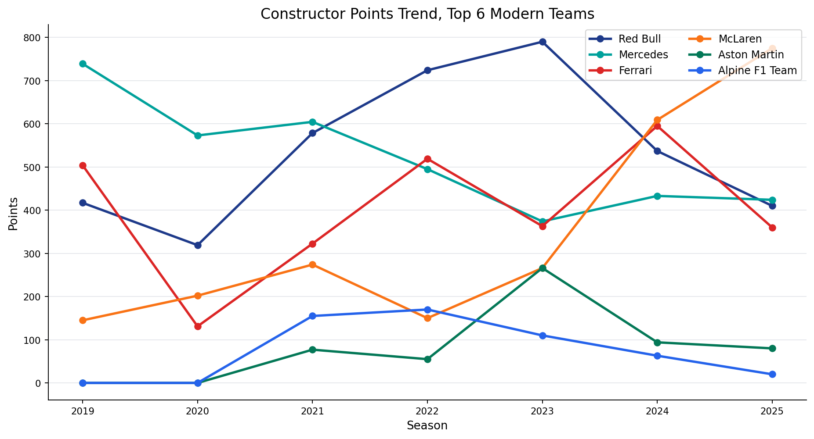

Shows season-by-season points for the leading constructors. It helps describe changes in team strength across seasons.

Use in report: constructor trend analysis.

#### [`constructor_points_share_top6.png`](figures/constructor_points_share_top6.png)

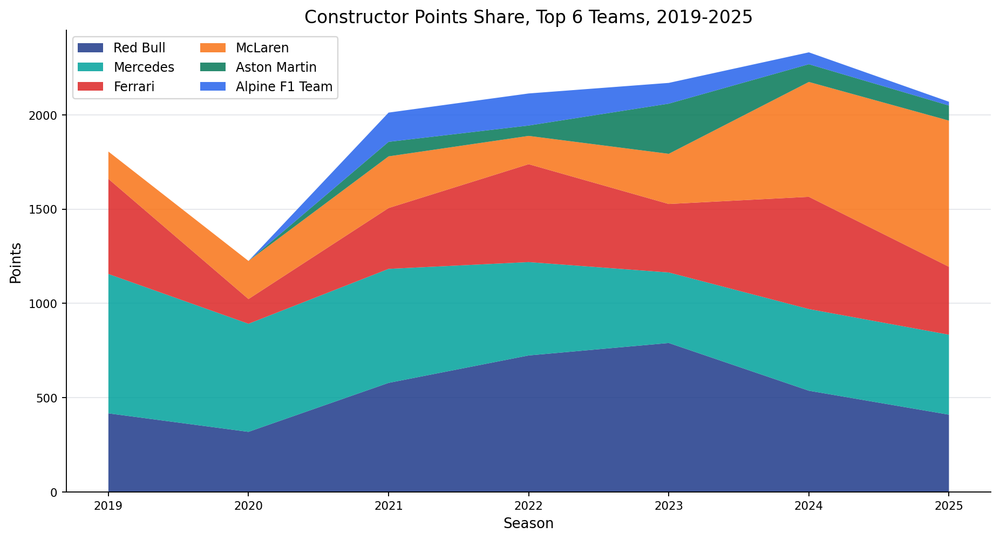

Shows how leading teams' point totals changed relative to each other over time. It visualizes team dominance and competition structure.

Use in report: constructor competition analysis.

#### [`constructor_podiums_wins_2019_2025.png`](figures/constructor_podiums_wins_2019_2025.png)

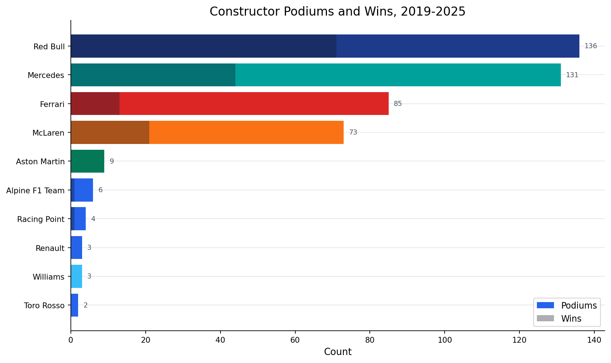

Compares podium counts and wins by constructor. It shows which teams regularly reached the podium and which converted performance into wins.

Use in report: constructor achievement analysis.

#### [`constructor_rank_bump_chart_2019_2025.png`](figures/constructor_rank_bump_chart_2019_2025.png)

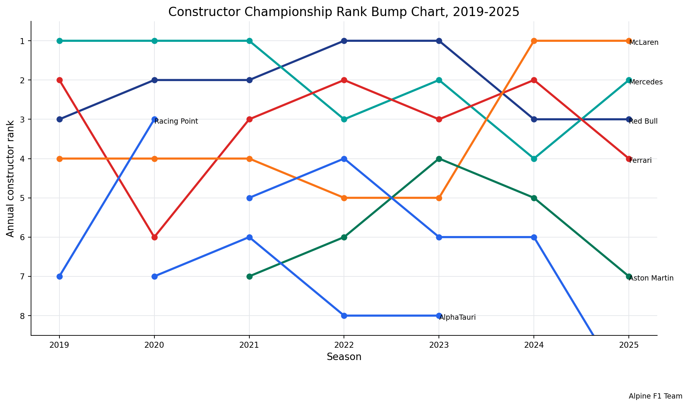

Shows how constructor championship ranking changed across seasons. This is useful for showing competitive shifts such as team rises or declines.

Use in report: team ranking evolution.

#### [`constructor_qualifying_race_efficiency_2019_2025.png`](figures/constructor_qualifying_race_efficiency_2019_2025.png)

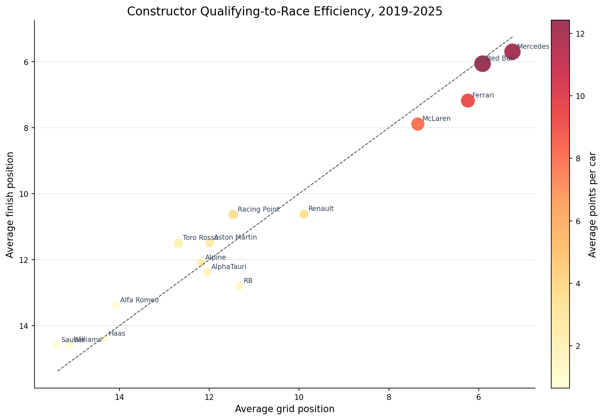

Compares average grid position and average finish position by constructor. Bubble size reflects podium rate and color reflects average points. This shows how efficiently teams convert qualifying position into race results.

Use in report: team efficiency analysis.

#### [`top_constructor_position_gain_2019_2025.png`](figures/top_constructor_position_gain_2019_2025.png)

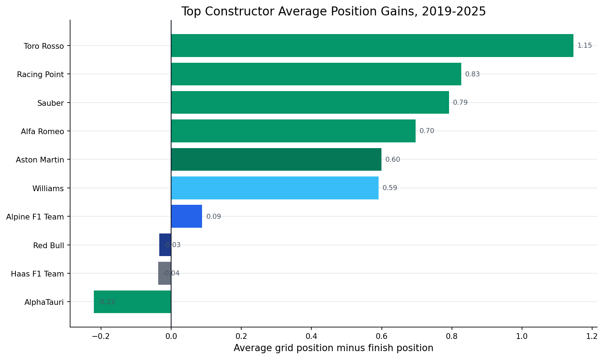

Ranks constructors by average position gain from grid to finish. It identifies teams whose cars or race execution tend to improve during races.

Use in report: constructor race execution analysis.

## Circuit Analysis

#### [`circuit_pole_win_rate_top12.png`](figures/circuit_pole_win_rate_top12.png)

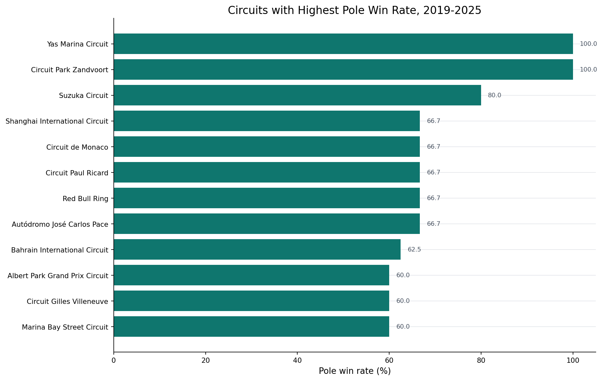

Ranks circuits by pole win rate. It identifies tracks where starting from pole position is especially valuable.

Use in report: circuit characteristic analysis.

#### [`circuit_position_change_2019_2025.png`](figures/circuit_position_change_2019_2025.png)

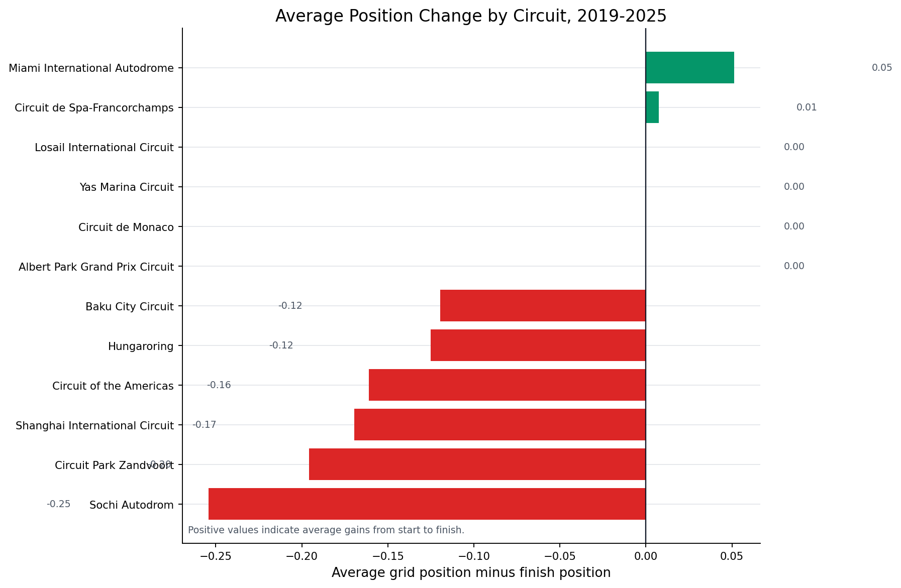

Shows average position change by circuit. Positive values indicate that drivers tend to gain positions from start to finish, while negative values indicate average loss.

Use in report: circuit overtaking and race-flow analysis.

#### [`circuit_grid_importance_bubble_2019_2025.png`](figures/circuit_grid_importance_bubble_2019_2025.png)

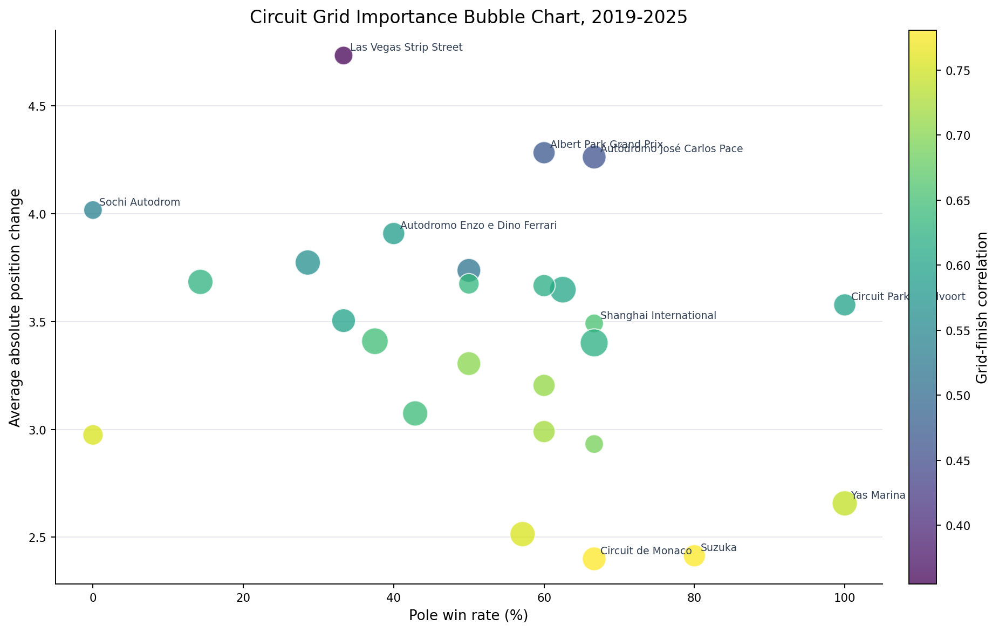

Compares circuits by pole win rate, average absolute position change, race count, and grid-finish correlation. This is a multi-variable view of how important qualifying and grid position are at different circuits.

Use in report: advanced circuit analysis.

#### [`circuit_grid_importance_score_2019_2025.png`](figures/circuit_grid_importance_score_2019_2025.png)

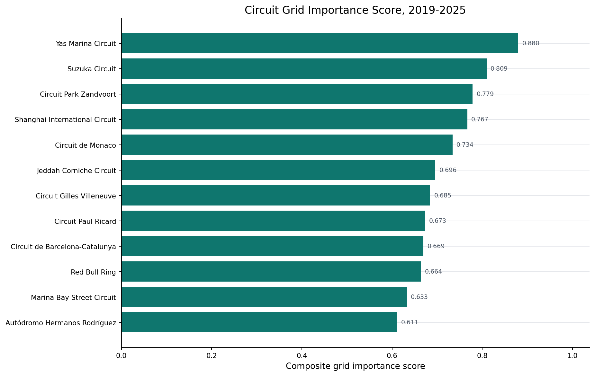

Ranks circuits using a composite grid importance score based on pole win rate, front-3 podium rate, and grid-finish correlation. It turns several circuit indicators into one interpretable metric.

Use in report: technical indicator construction.

## Advanced Analytical Indicators

#### [`feature_correlation_heatmap_2019_2025.png`](figures/feature_correlation_heatmap_2019_2025.png)

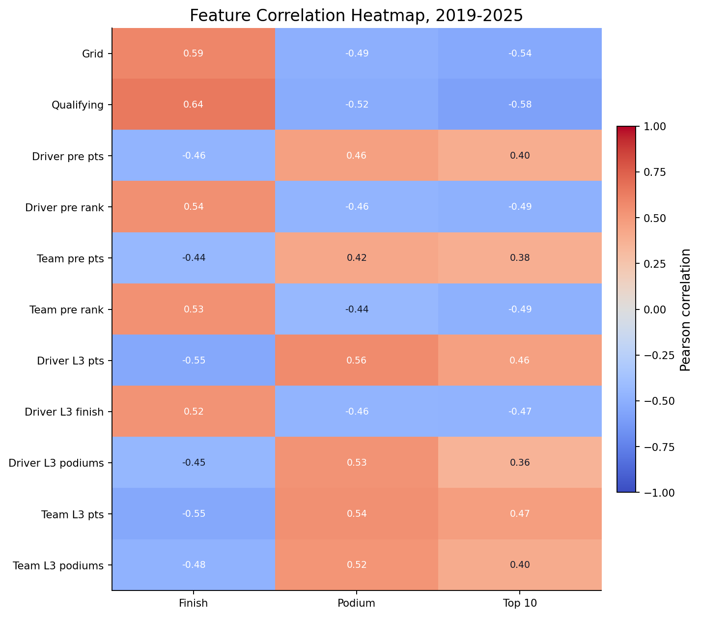

Shows correlations between pre-race features and target outcomes such as finish position, podium, and top-10 finish. It supports the later prediction task by showing which features contain useful information.

Use in report: feature analysis and modeling motivation.

#### [`constructor_competitiveness_by_year_2019_2025.png`](figures/constructor_competitiveness_by_year_2019_2025.png)

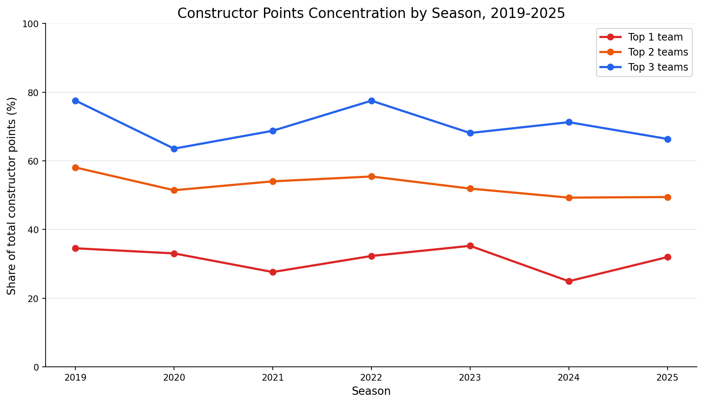

Shows the share of total constructor points captured by the top 1, top 2, and top 3 teams each season. It measures how concentrated the competition is.

Use in report: competitive balance analysis.

#### [`constructor_hhi_competitiveness_2019_2025.png`](figures/constructor_hhi_competitiveness_2019_2025.png)

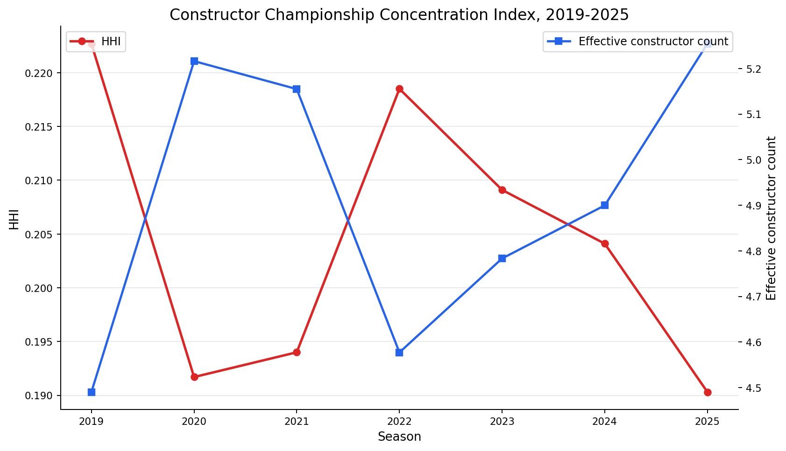

Uses the Herfindahl-Hirschman Index (HHI) and effective constructor count to measure competitive concentration. A higher HHI means points are more concentrated among fewer teams.

Use in report: professional competition concentration metric.

#### [`pre_race_strength_podium_rate_2019_2025.png`](figures/pre_race_strength_podium_rate_2019_2025.png)

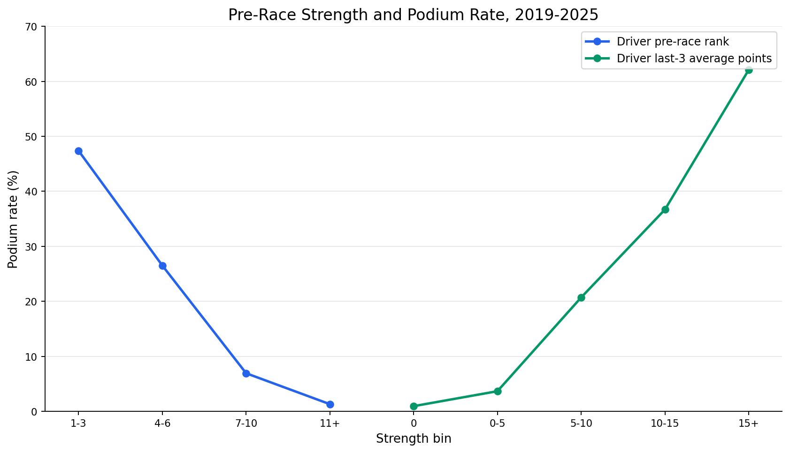

Shows podium rate by pre-race strength bins, such as driver pre-race rank and recent average points. It checks whether pre-race information can separate high-probability podium candidates from lower-probability drivers.

Use in report: pre-race feature effectiveness analysis.

#### [`status_mix_by_year_2019_2025.png`](figures/status_mix_by_year_2019_2025.png)

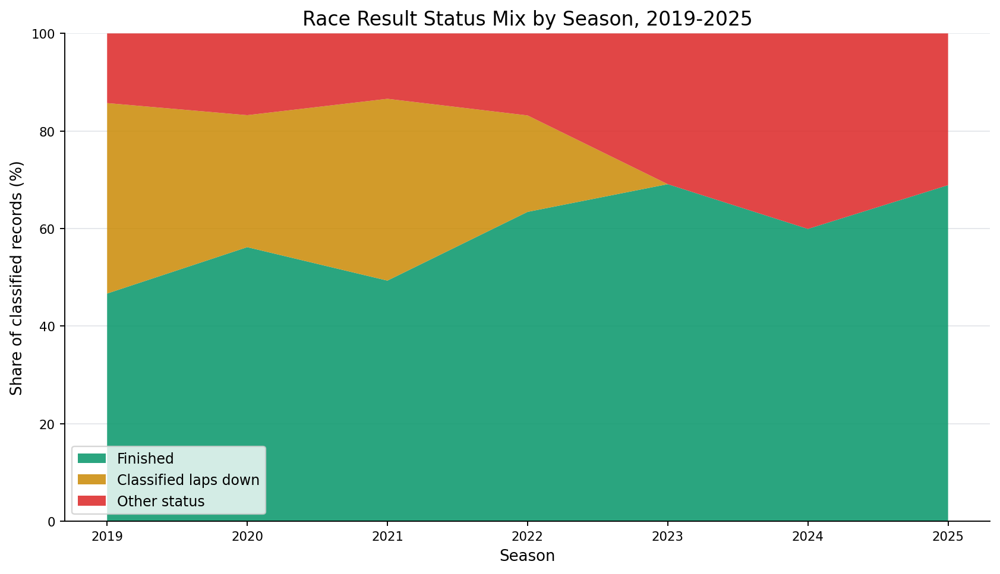

Shows the share of finished, lapped, and other race statuses by season. It provides a basic reliability and race-completion view.

Use in report: race status and reliability analysis.

## Videos

Videos are tracked in Git for direct report and presentation use. They can also be regenerated by running `python animate_f1_points.py`.

#### [`constructor_points_race_progress_1950_2025.mp4`](videos/constructor_points_race_progress_1950_2025.mp4)

Animated bar chart showing constructor season cumulative points after each race from 1950 to 2025. Points reset at the start of each season, matching championship rules.

Use in report or presentation: dynamic team standings evolution.

#### [`constructor_all_time_points_progress_1950_2025.mp4`](videos/constructor_all_time_points_progress_1950_2025.mp4)

Animated bar chart showing all-time constructor cumulative points from 1950 to 2025. Points do not reset between seasons. This video shows long-term constructor influence and historical accumulation.

Use in report or presentation: long-term constructor dominance.

#### [`driver_points_race_progress_2019_2025.mp4`](videos/driver_points_race_progress_2019_2025.mp4)

Animated bar chart showing driver season cumulative points after each race from 2019 to 2025. Points reset at the start of each season.

Use in report or presentation: modern driver standings evolution.

## Manifests

#### [`figures/figure_manifest.csv`](figures/figure_manifest.csv) and [`figures/figure_manifest.json`](figures/figure_manifest.json)

These files list all generated figures, their titles, source data, and descriptions.

#### [`videos/video_manifest.json`](videos/video_manifest.json)

This file lists all generated videos, their titles, data ranges, sources, frame counts, and descriptions.

## Model Figures

#### [`figures/podium_model_confusion_matrix_2025.png`](figures/podium_model_confusion_matrix_2025.png)

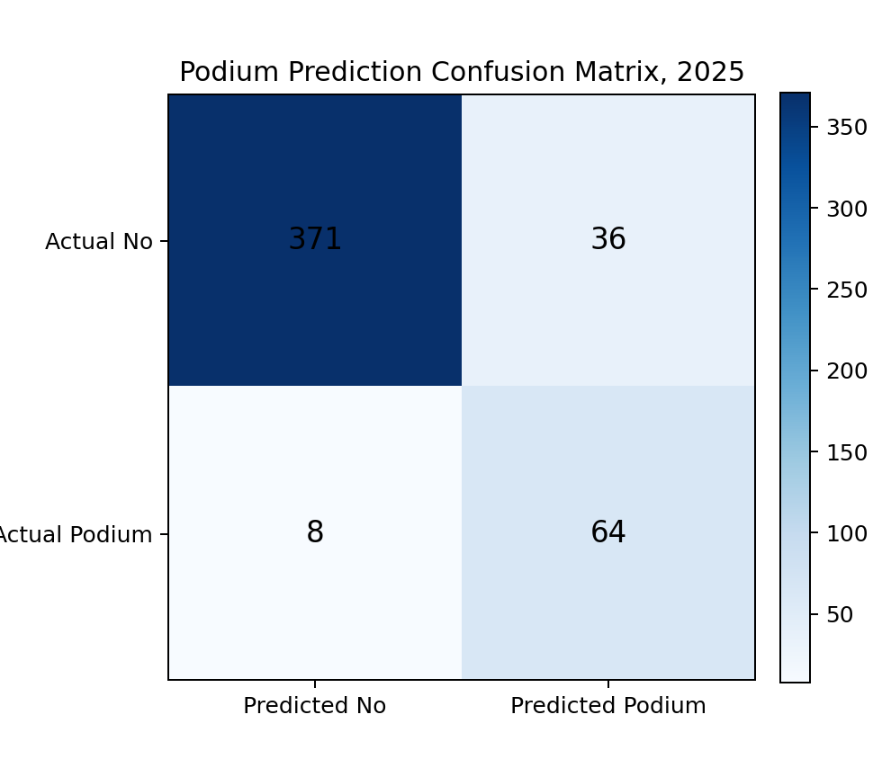

Shows the 2025 backtest confusion matrix for the selected podium prediction model. It compares actual podium labels with predicted podium labels.

Use in report: machine learning model evaluation.

#### [`figures/podium_model_feature_importance_2025.png`](figures/podium_model_feature_importance_2025.png)

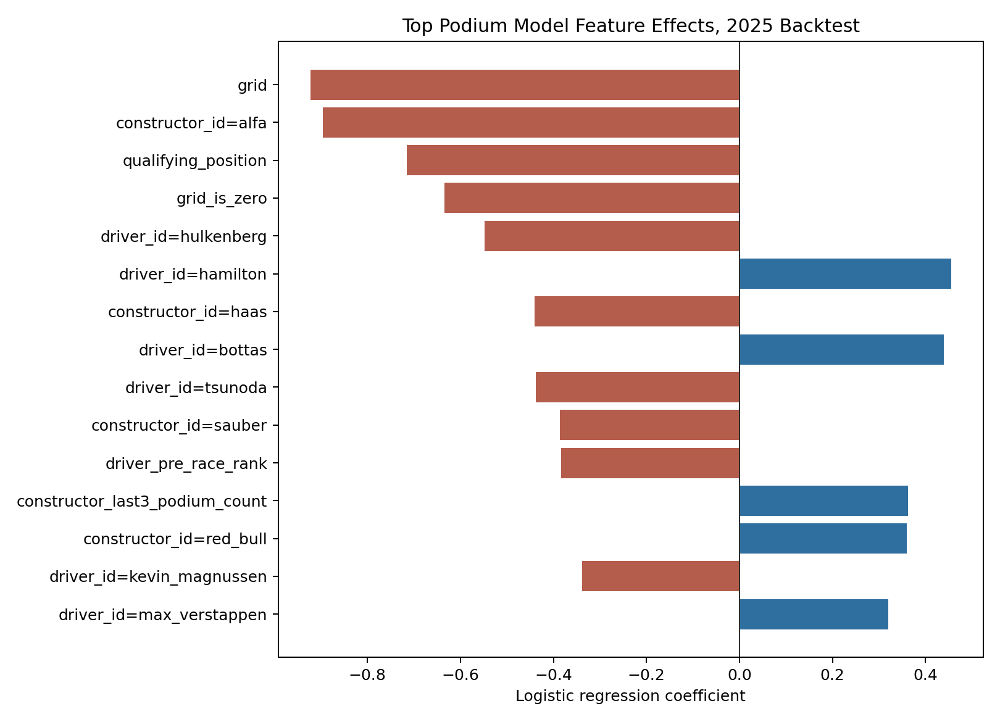

Shows the strongest logistic-regression feature effects for podium prediction. Positive coefficients increase podium probability, while negative coefficients reduce it.

Use in report: model interpretation and feature analysis.
