# Outputs Description

This document explains the figures and videos generated by the Formula 1 analysis pipeline. Static figures are stored in `outputs/figures/`; videos are stored in `outputs/videos/`.

## Static Figures

All report-oriented static figures exclude 2026 data. Modern figures use 2019-2025 data, while historical figures use the SQLite historical dataset.

### Dataset and Historical Background

#### [`yearly_records_2019_2025.png`](figures/yearly_records_2019_2025.png)

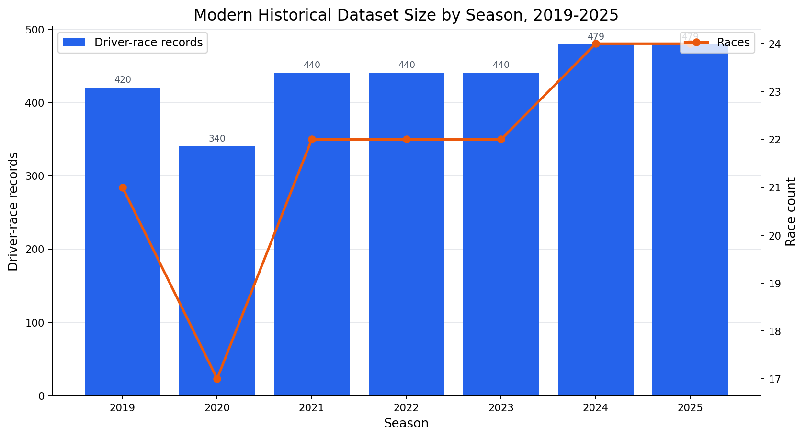

Shows the number of driver-race records and race count in each modern season from 2019 to 2025. It explains the scale and year coverage of the modern analysis dataset.

Use in report: dataset description.

#### [`historical_races_by_year.png`](figures/historical_races_by_year.png)

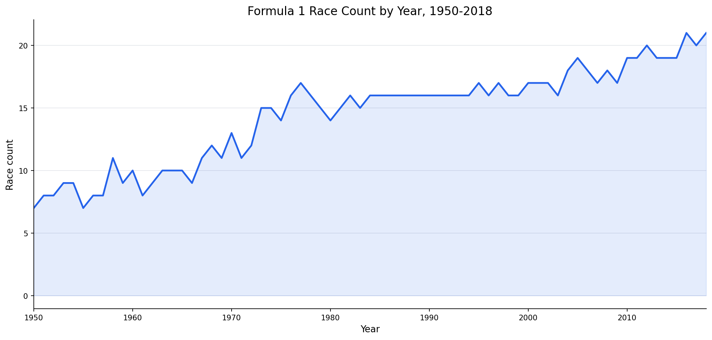

Shows how the Formula 1 calendar expanded from 1950 to 2018. It provides historical background and shows that the sport has grown from a small calendar to a larger global championship.

Use in report: case background.

#### [`historical_top10_driver_wins.png`](figures/historical_top10_driver_wins.png)

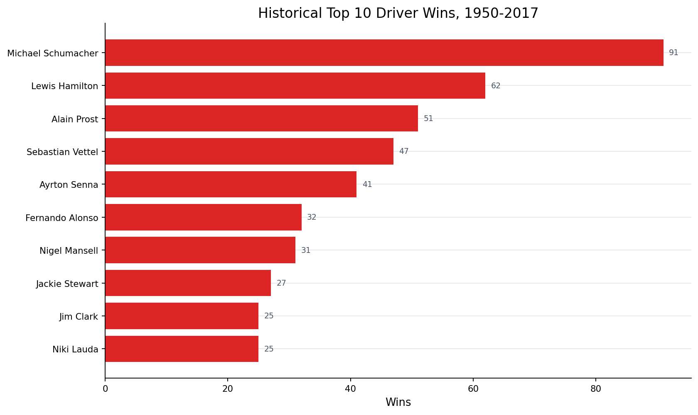

Ranks the top 10 race-winning drivers in the historical SQLite data. It identifies historically dominant drivers such as Michael Schumacher, Lewis Hamilton, Alain Prost, Sebastian Vettel, and Ayrton Senna.

Use in report: case background and historical context.

#### [`historical_top10_constructor_wins.png`](figures/historical_top10_constructor_wins.png)

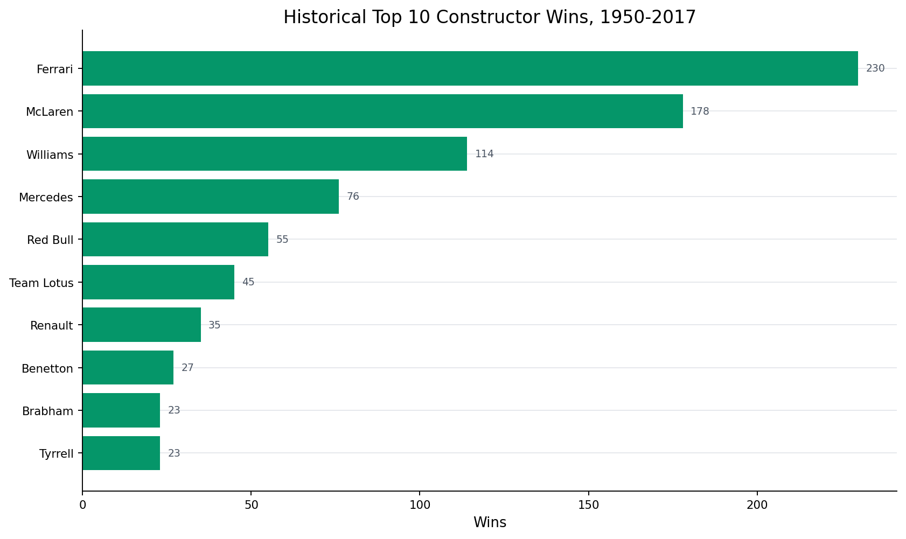

Ranks the top 10 race-winning constructors in the historical SQLite data. It highlights long-term constructor dominance, especially Ferrari, McLaren, Williams, Mercedes, and Red Bull.

Use in report: case background and historical context.

## Grid, Qualifying, and Race Result Analysis

#### [`grid_position_outcome_rates.png`](figures/grid_position_outcome_rates.png)

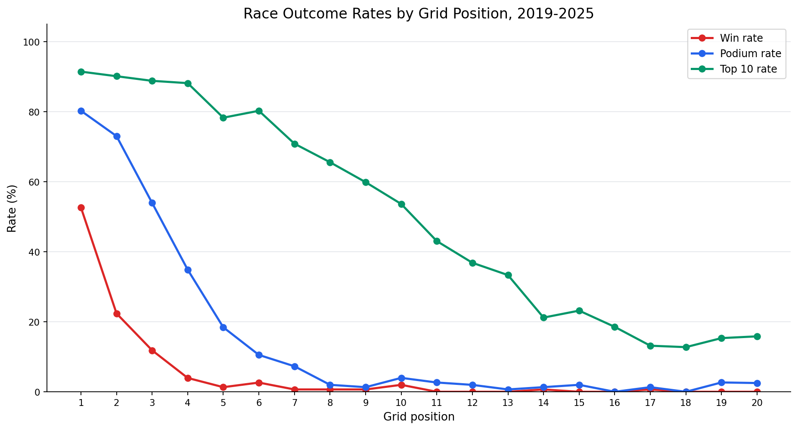

Compares win rate, podium rate, and top-10 rate by starting grid position for 2019-2025. It shows that better starting positions generally lead to better race outcomes.

Use in report: analysis of starting grid influence.

#### [`qualifying_position_outcome_rates.png`](figures/qualifying_position_outcome_rates.png)

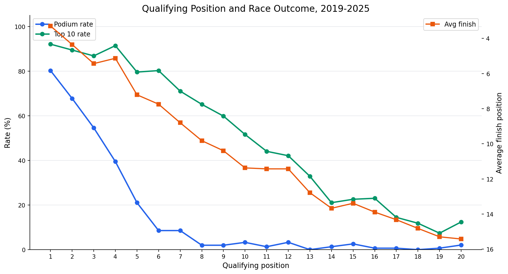

Shows how qualifying position relates to podium rate, top-10 rate, and average finish position. It demonstrates the predictive value of qualifying performance.

Use in report: analysis of qualifying influence.

#### [`qualifying_finish_heatmap_2019_2025.png`](figures/qualifying_finish_heatmap_2019_2025.png)

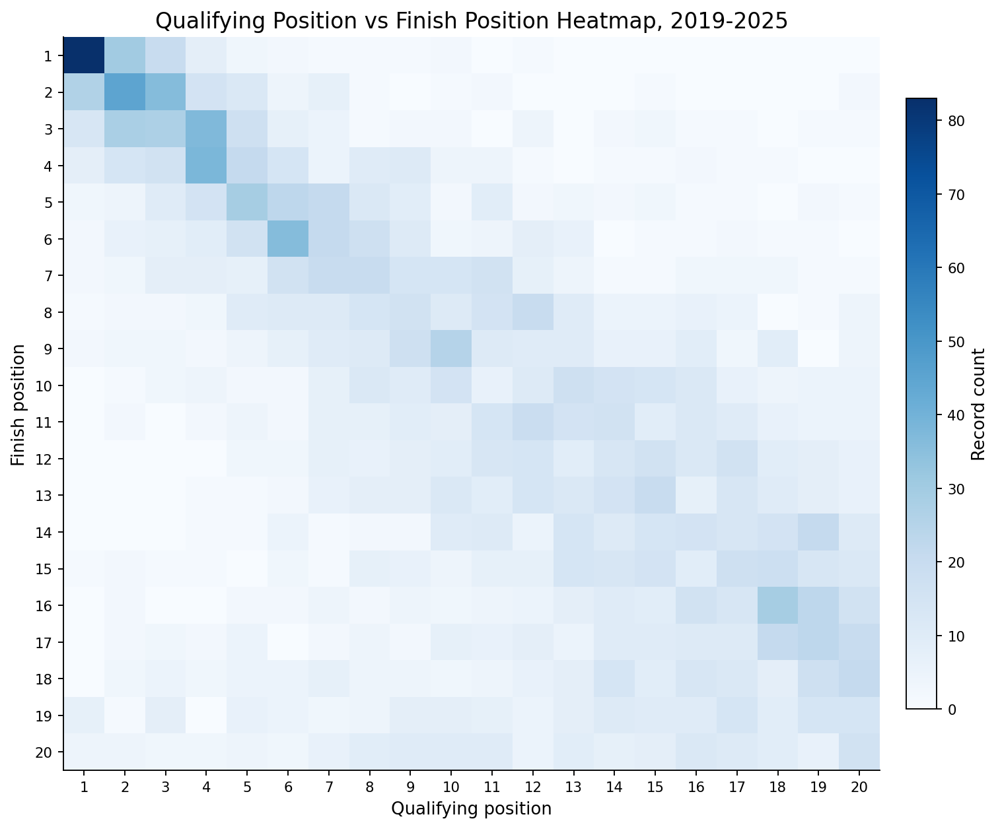

Displays the joint distribution of qualifying position and finish position. Darker cells indicate more frequent combinations. This is more informative than a simple average because it shows the full distribution of race outcomes.

Use in report: technical analysis of qualifying-to-race relationship.

#### [`grid_advantage_historical_vs_modern.png`](figures/grid_advantage_historical_vs_modern.png)

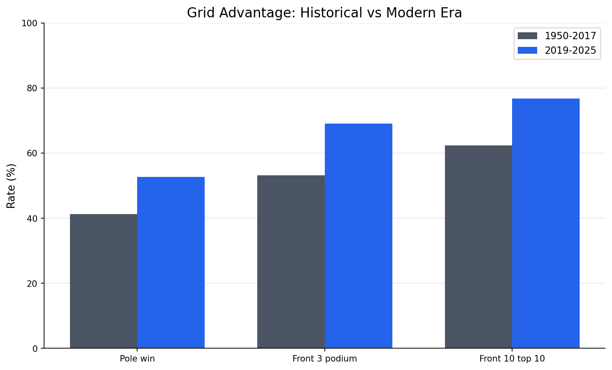

Compares historical and modern grid advantage using pole win rate, front-3 podium rate, and front-10 top-10 rate. It shows whether starting position has become more or less important in the modern era.

Use in report: historical-modern comparison.

#### [`position_change_distribution_2019_2025.png`](figures/position_change_distribution_2019_2025.png)

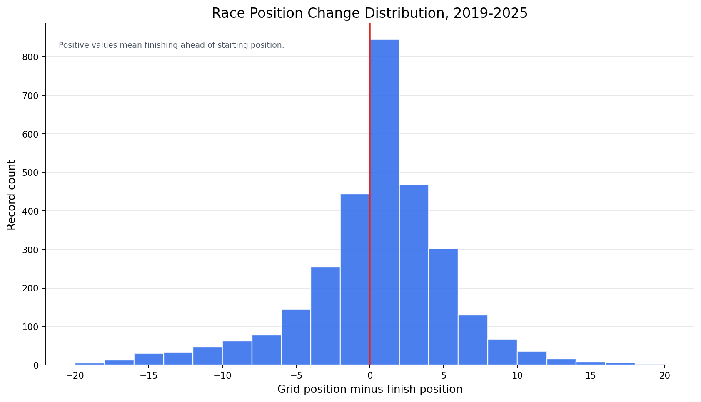

Shows how often drivers gained or lost positions relative to their grid starts. Positive values mean a driver finished ahead of the starting position.

Use in report: race position-change analysis.

## Driver Analysis

#### [`top10_driver_points_2019_2025.png`](figures/top10_driver_points_2019_2025.png)

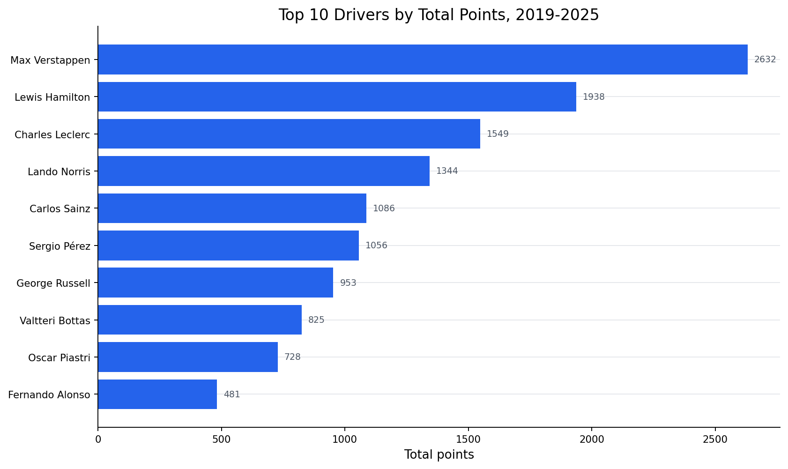

Ranks the top 10 drivers by total points from 2019 to 2025. It gives a direct view of modern driver performance.

Use in report: driver performance overview.

#### [`driver_points_trend_top6.png`](figures/driver_points_trend_top6.png)

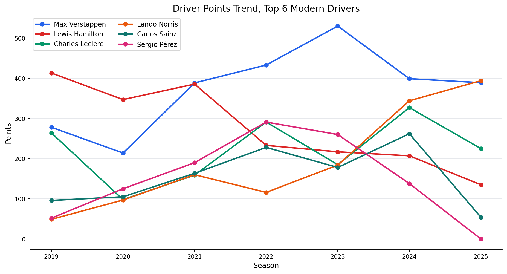

Shows season-by-season points for the top modern drivers. It helps identify changes in driver form and dominance over time.

Use in report: driver trend analysis.

#### [`driver_points_heatmap_top10.png`](figures/driver_points_heatmap_top10.png)

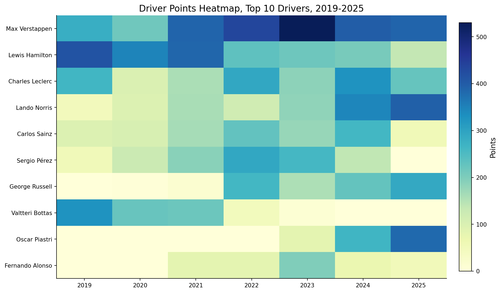

Shows year-by-year points for the top 10 drivers as a heatmap. It makes it easier to compare multiple drivers and seasons in one compact figure.

Use in report: driver trend comparison.

#### [`driver_podiums_wins_2019_2025.png`](figures/driver_podiums_wins_2019_2025.png)

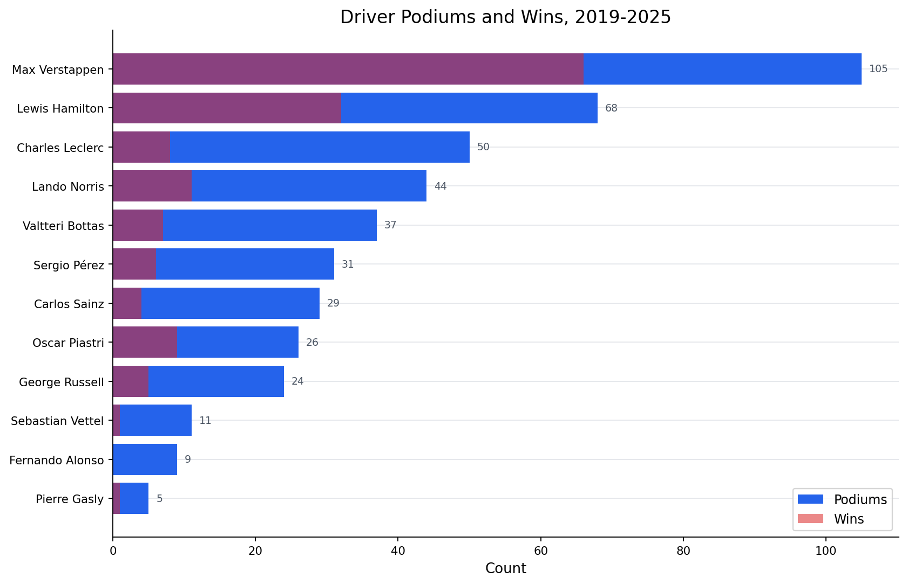

Compares podium counts and wins by driver. It separates consistent podium performance from race-winning ability.

Use in report: driver achievement analysis.

#### [`driver_consistency_scatter_2019_2025.png`](figures/driver_consistency_scatter_2019_2025.png)

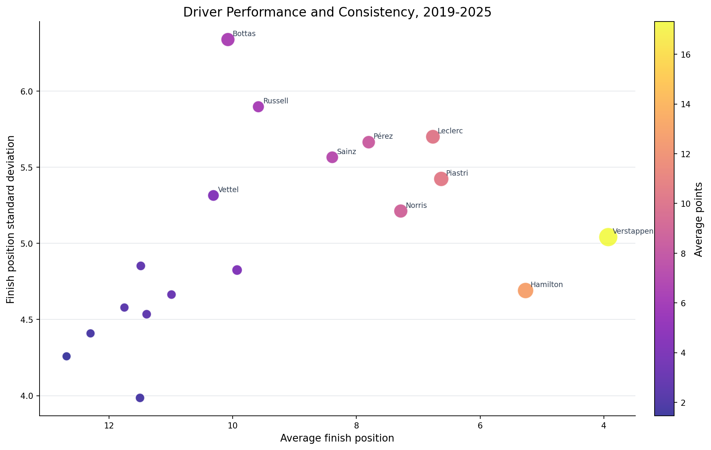

Compares drivers by average finish position, finish-position variability, podium rate, and average points. It reflects both performance level and stability.

Use in report: driver stability and consistency analysis.

#### [`top_driver_position_gain_2019_2025.png`](figures/top_driver_position_gain_2019_2025.png)

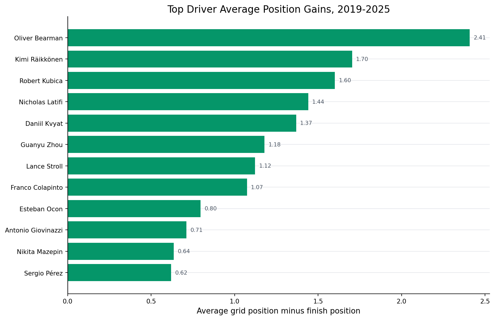

Ranks drivers by average position gain from grid to finish. It identifies drivers who tend to improve their race position after the start.

Use in report: racecraft and position-gain analysis.

## Constructor Analysis

#### [`constructor_points_2019_2025.png`](figures/constructor_points_2019_2025.png)

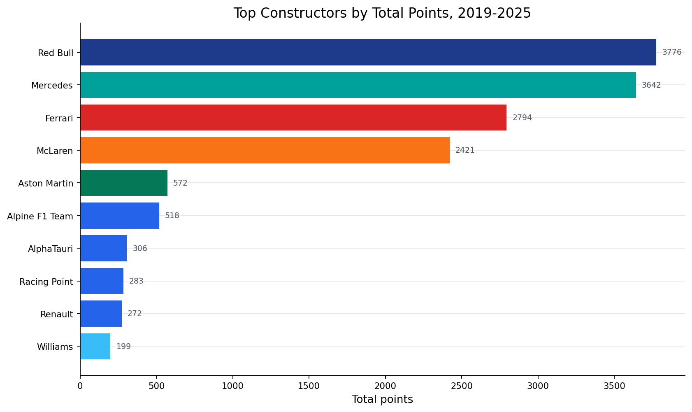

Ranks constructors by total points from 2019 to 2025. It summarizes the main competitive order among teams.

Use in report: constructor performance overview.

#### [`constructor_points_trend_top6.png`](figures/constructor_points_trend_top6.png)

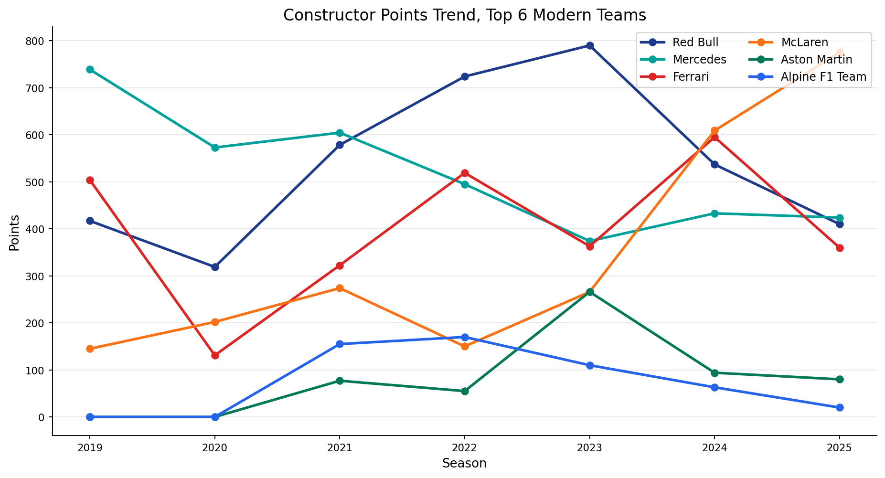

Shows season-by-season points for the leading constructors. It helps describe changes in team strength across seasons.

Use in report: constructor trend analysis.

#### [`constructor_points_share_top6.png`](figures/constructor_points_share_top6.png)

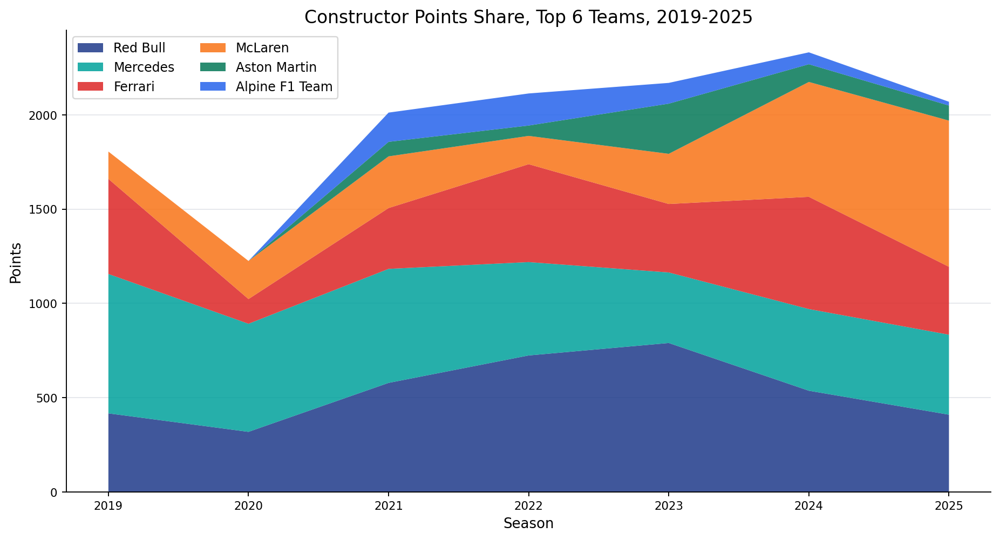

Shows how leading teams' point totals changed relative to each other over time. It visualizes team dominance and competition structure.

Use in report: constructor competition analysis.

#### [`constructor_podiums_wins_2019_2025.png`](figures/constructor_podiums_wins_2019_2025.png)

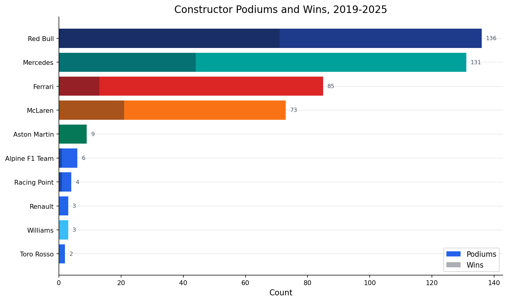

Compares podium counts and wins by constructor. It shows which teams regularly reached the podium and which converted performance into wins.

Use in report: constructor achievement analysis.

#### [`constructor_rank_bump_chart_2019_2025.png`](figures/constructor_rank_bump_chart_2019_2025.png)

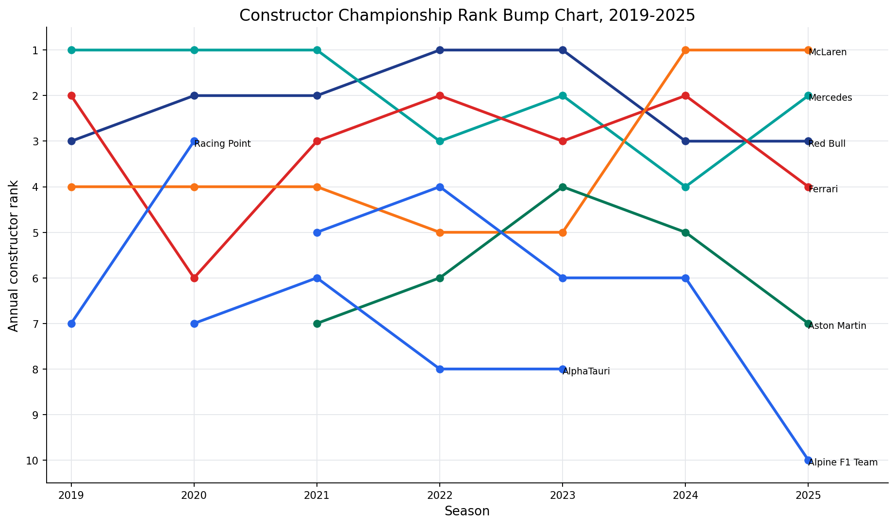

Shows how constructor championship ranking changed across seasons. This is useful for showing competitive shifts such as team rises or declines.

Use in report: team ranking evolution.

#### [`constructor_qualifying_race_efficiency_2019_2025.png`](figures/constructor_qualifying_race_efficiency_2019_2025.png)

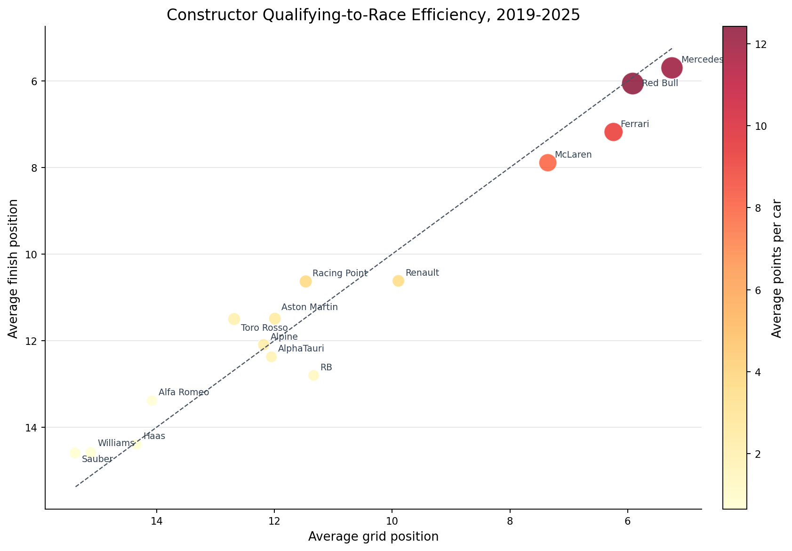

Compares average grid position and average finish position by constructor. Bubble size reflects podium rate and color reflects average points. This shows how efficiently teams convert qualifying position into race results.

Use in report: team efficiency analysis.

#### [`top_constructor_position_gain_2019_2025.png`](figures/top_constructor_position_gain_2019_2025.png)

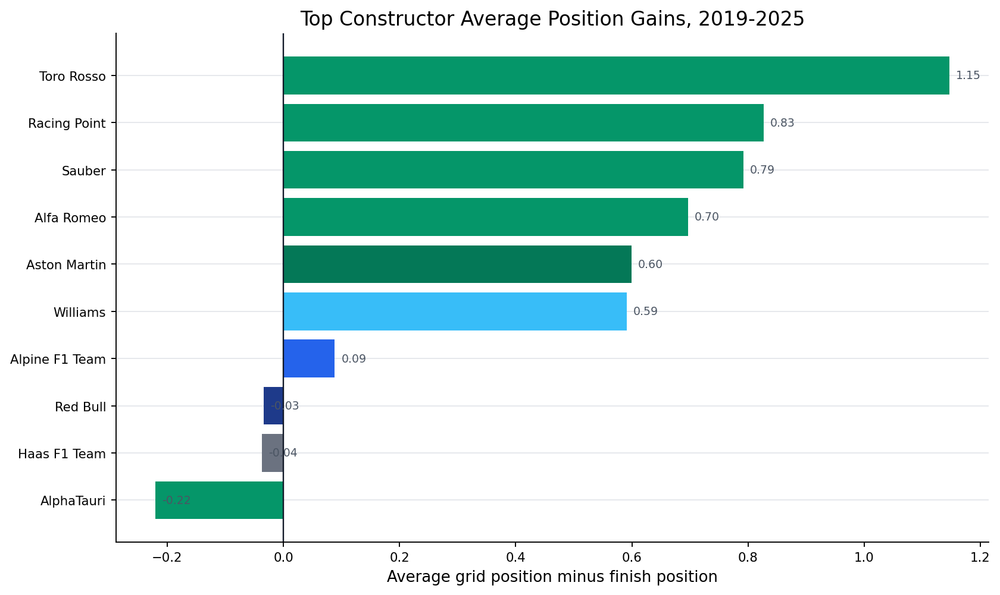

Ranks constructors by average position gain from grid to finish. It identifies teams whose cars or race execution tend to improve during races.

Use in report: constructor race execution analysis.

## Circuit Analysis

#### [`circuit_pole_win_rate_top12.png`](figures/circuit_pole_win_rate_top12.png)

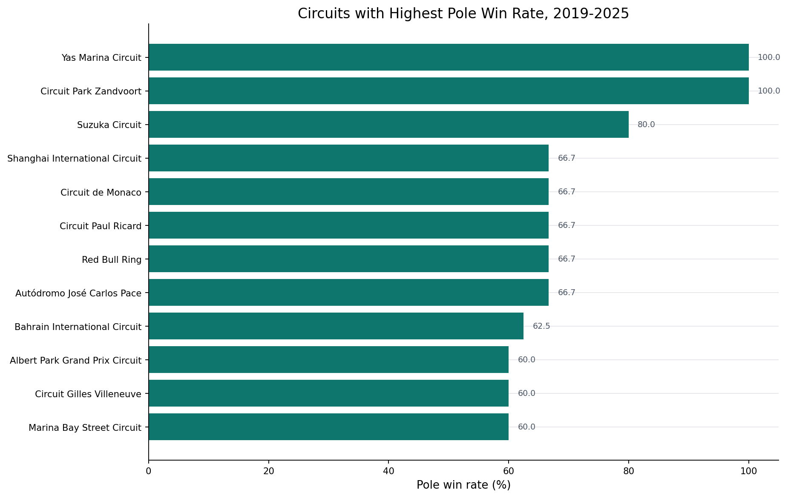

Ranks circuits by pole win rate. It identifies tracks where starting from pole position is especially valuable.

Use in report: circuit characteristic analysis.

#### [`circuit_position_change_2019_2025.png`](figures/circuit_position_change_2019_2025.png)

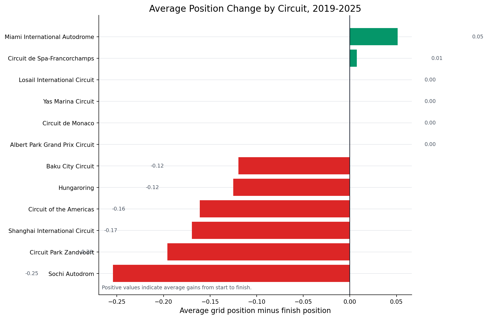

Shows average position change by circuit. Positive values indicate that drivers tend to gain positions from start to finish, while negative values indicate average loss.

Use in report: circuit overtaking and race-flow analysis.

#### [`circuit_grid_importance_bubble_2019_2025.png`](figures/circuit_grid_importance_bubble_2019_2025.png)

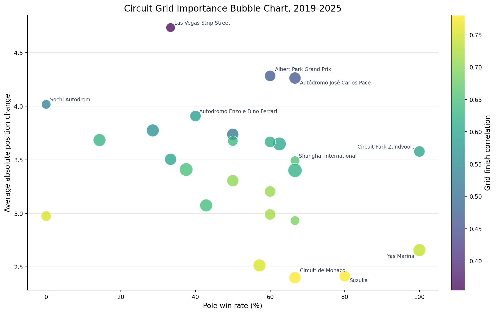

Compares circuits by pole win rate, average absolute position change, race count, and grid-finish correlation. This is a multi-variable view of how important qualifying and grid position are at different circuits.

Use in report: advanced circuit analysis.

#### [`circuit_grid_importance_score_2019_2025.png`](figures/circuit_grid_importance_score_2019_2025.png)

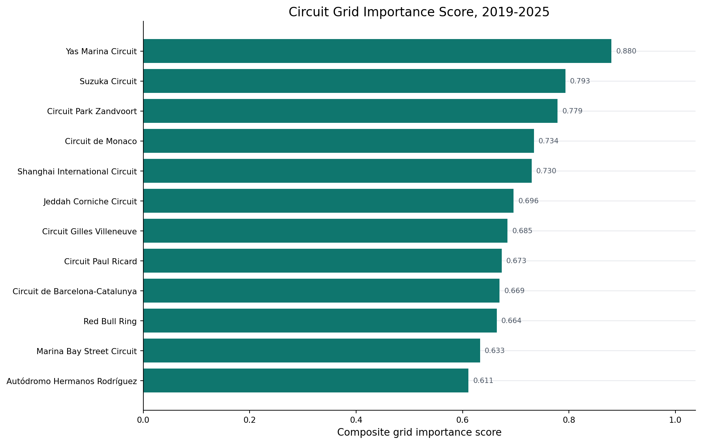

Ranks circuits using a composite grid importance score based on pole win rate, front-3 podium rate, and grid-finish correlation. It turns several circuit indicators into one interpretable metric.

Use in report: technical indicator construction.

## Advanced Analytical Indicators

#### [`feature_correlation_heatmap_2019_2025.png`](figures/feature_correlation_heatmap_2019_2025.png)

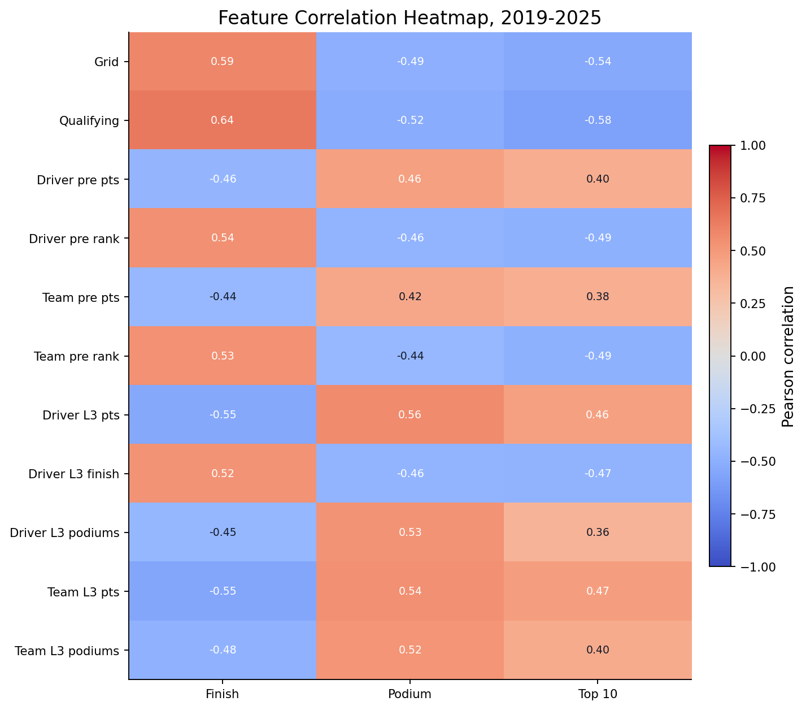

Shows correlations between pre-race features and target outcomes such as finish position, podium, and top-10 finish. It supports the later prediction task by showing which features contain useful information.

Use in report: feature analysis and modeling motivation.

#### [`constructor_competitiveness_by_year_2019_2025.png`](figures/constructor_competitiveness_by_year_2019_2025.png)

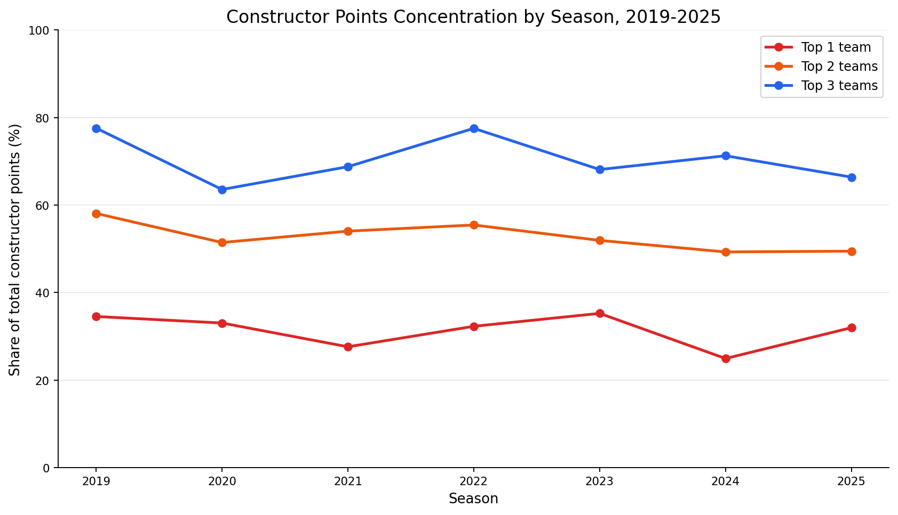

Shows the share of total constructor points captured by the top 1, top 2, and top 3 teams each season. It measures how concentrated the competition is.

Use in report: competitive balance analysis.

#### [`constructor_hhi_competitiveness_2019_2025.png`](figures/constructor_hhi_competitiveness_2019_2025.png)

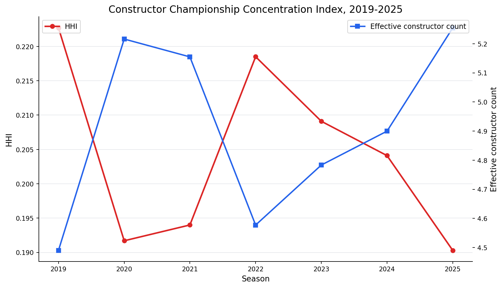

Uses the Herfindahl-Hirschman Index (HHI) and effective constructor count to measure competitive concentration. A higher HHI means points are more concentrated among fewer teams.

Use in report: professional competition concentration metric.

#### [`pre_race_strength_podium_rate_2019_2025.png`](figures/pre_race_strength_podium_rate_2019_2025.png)

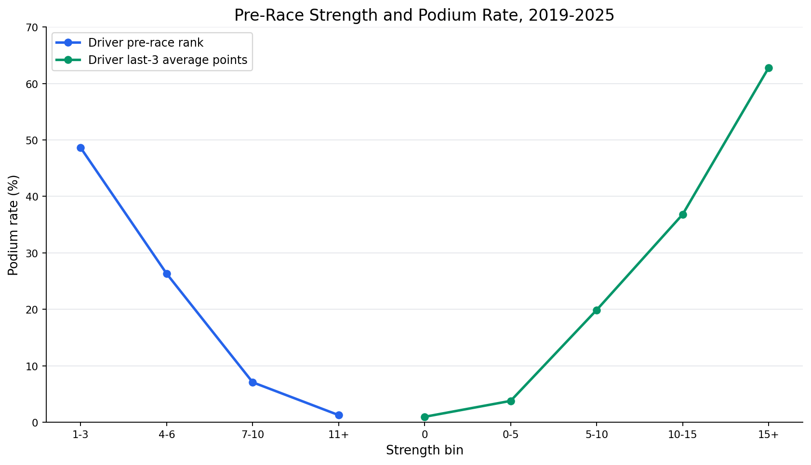

Shows podium rate by pre-race strength bins, such as driver pre-race rank and recent average points. It checks whether pre-race information can separate high-probability podium candidates from lower-probability drivers.

Use in report: pre-race feature effectiveness analysis.

#### [`status_mix_by_year_2019_2025.png`](figures/status_mix_by_year_2019_2025.png)

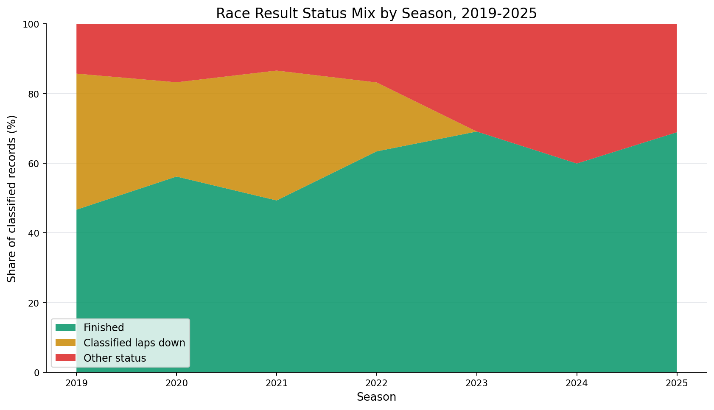

Shows the share of finished, lapped, and other race statuses by season. It provides a basic reliability and race-completion view.

Use in report: race status and reliability analysis.

## Videos

Videos are tracked in Git for direct report and presentation use. They can also be regenerated by running `python animate_f1_points.py`.

#### [`constructor_points_race_progress_1950_2025.mp4`](videos/constructor_points_race_progress_1950_2025.mp4)

Animated bar chart showing constructor season cumulative points after each race from 1950 to 2025. Points reset at the start of each season, matching championship rules.

Use in report or presentation: dynamic team standings evolution.

#### [`constructor_all_time_points_progress_1950_2025.mp4`](videos/constructor_all_time_points_progress_1950_2025.mp4)

Animated bar chart showing all-time constructor cumulative points from 1950 to 2025. Points do not reset between seasons. This video shows long-term constructor influence and historical accumulation.

Use in report or presentation: long-term constructor dominance.

#### [`driver_points_race_progress_2019_2025.mp4`](videos/driver_points_race_progress_2019_2025.mp4)

Animated bar chart showing driver season cumulative points after each race from 2019 to 2025. Points reset at the start of each season.

Use in report or presentation: modern driver standings evolution.

## Manifests

#### [`figures/figure_manifest.csv`](figures/figure_manifest.csv) and [`figures/figure_manifest.json`](figures/figure_manifest.json)

These files list all generated figures, their titles, source data, and descriptions.

#### [`videos/video_manifest.json`](videos/video_manifest.json)

This file lists all generated videos, their titles, data ranges, sources, frame counts, and descriptions.

## Model Figures

#### [`figures/podium_model_confusion_matrix_2025.png`](figures/podium_model_confusion_matrix_2025.png)

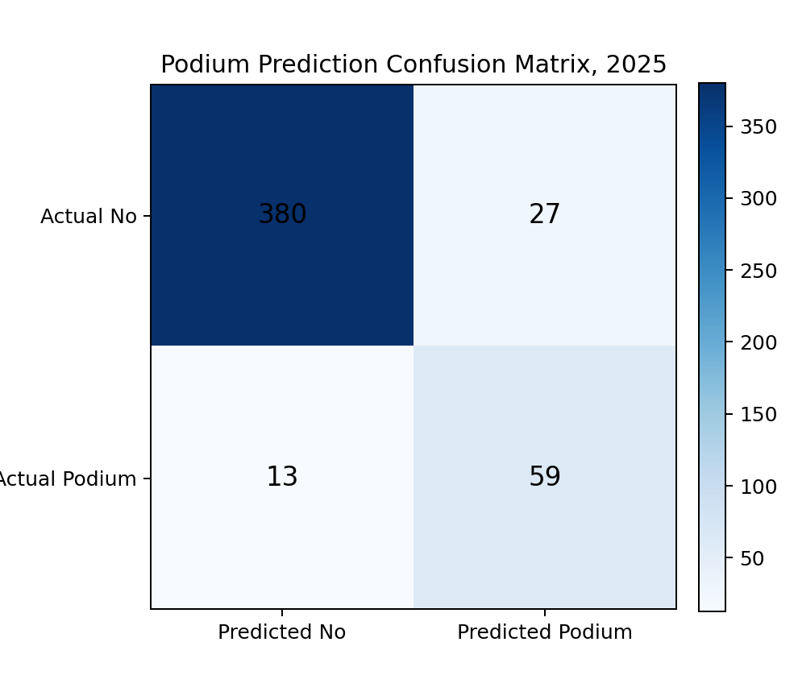

Shows the 2025 backtest confusion matrix for the selected podium prediction model. It compares actual podium labels with predicted podium labels.

Use in report: machine learning model evaluation.

#### [`figures/podium_model_feature_importance_2025.png`](figures/podium_model_feature_importance_2025.png)

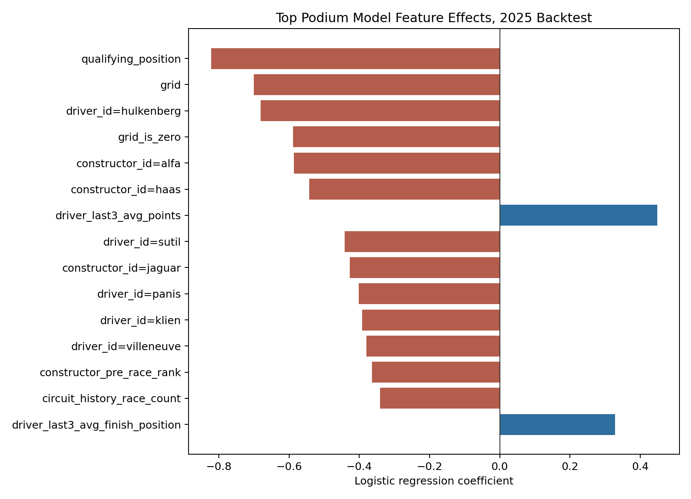

Shows the strongest logistic-regression feature effects for podium prediction. Positive coefficients increase podium probability, while negative coefficients reduce it.

Use in report: model interpretation and feature analysis.

#### [`figures/podium_model_comparison_2025.png`](figures/podium_model_comparison_2025.png)

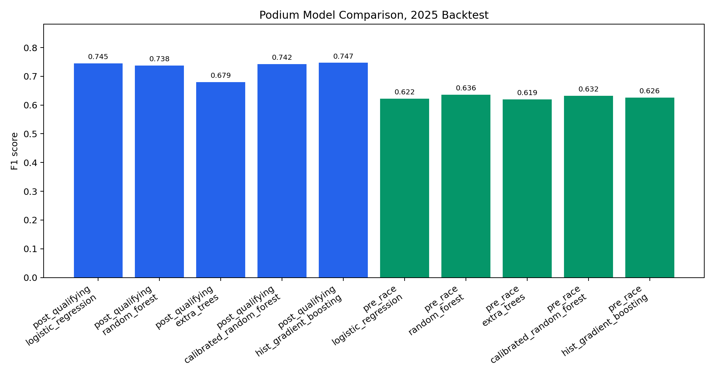

Compares 2025 F1 scores across post-qualifying and pre-race model settings. It shows how much predictive power is gained after qualifying and grid information is available.

Use in report: model comparison.

#### [`figures/podium_rolling_backtest_summary.png`](figures/podium_rolling_backtest_summary.png)

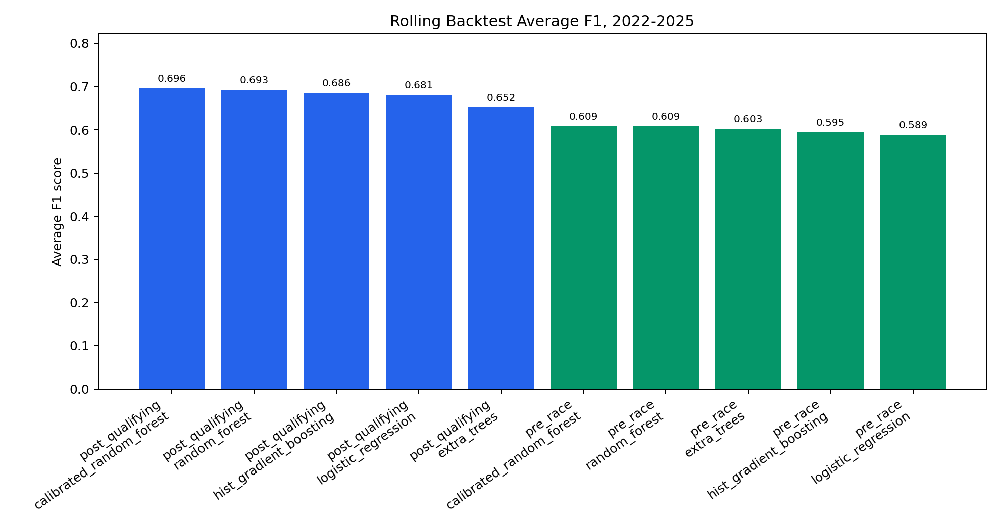

Shows average F1 scores across expanding-window rolling backtests from 2022 to 2025. It checks whether model performance is stable across multiple test seasons rather than only one season.

Use in report: robustness evaluation.

#### [`figures/deep_podium_training_curve.png`](figures/deep_podium_training_curve.png)

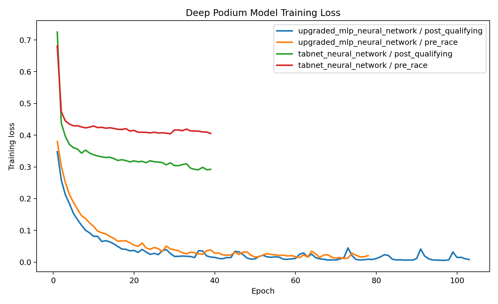

Shows the training loss curves for the upgraded MLP and TabNet podium models under post-qualifying and pre-race feature modes. It is used to compare deeper neural-network models with tree-based machine learning models.

Use in report: deep-learning comparison experiment.

#### [`figures/podium_all_models_f1_comparison.png`](figures/podium_all_models_f1_comparison.png)

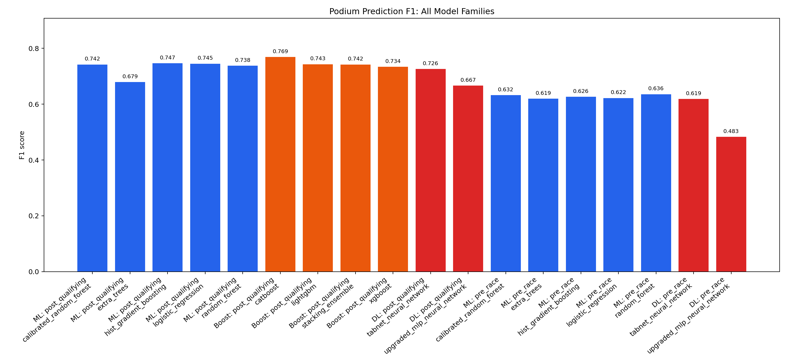

Compares F1 scores for traditional machine learning, advanced boosting/stacking models, upgraded MLP, and TabNet. It shows the overall balance between precision and recall for podium prediction.

Use in report: model performance comparison.

#### [`figures/podium_all_models_roc_auc_comparison.png`](figures/podium_all_models_roc_auc_comparison.png)

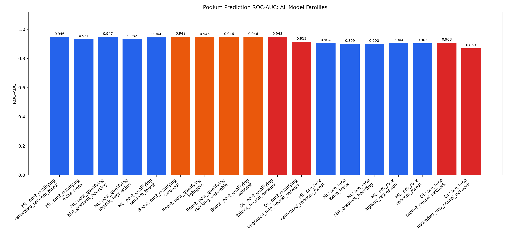

Compares ROC-AUC scores for all model families, showing how well each model separates likely podium drivers from non-podium drivers.

Use in report: model discrimination ability.

#### [`figures/podium_all_models_top3_precision.png`](figures/podium_all_models_top3_precision.png)

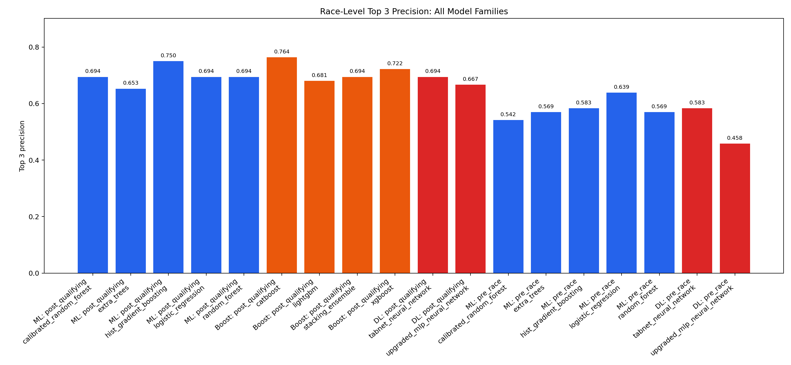

Compares race-level Top 3 precision across all model families, which measures how many of each model's three predicted podium candidates actually finished on the podium.

Use in report: race-level prediction evaluation.

#### [`figures/podium_best_models_by_family.png`](figures/podium_best_models_by_family.png)

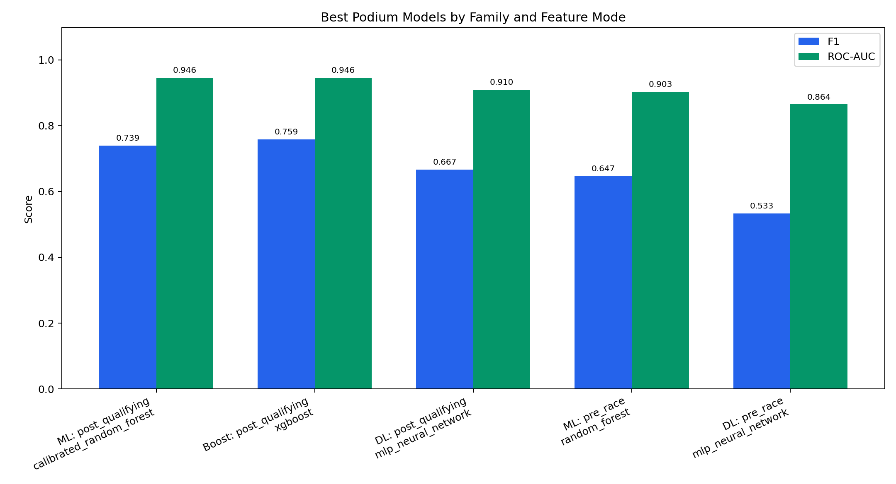

Compares the best model from each family and feature mode using F1 and ROC-AUC. It provides a compact summary of the strongest traditional ML, advanced ML, and deep-learning results.

Use in report: final model comparison.

#### [`figures/podium_all_model_metric_heatmap.png`](figures/podium_all_model_metric_heatmap.png)

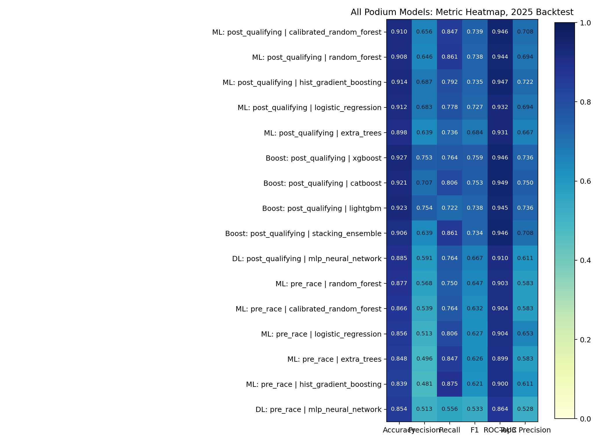

Displays accuracy, precision, recall, F1, ROC-AUC, and race-level Top 3 precision for every trained model in one heatmap. This is the most complete single figure for comparing all model effects.

Use in report: comprehensive model evaluation.

#### [`figures/podium_ml_2025_vs_rolling_f1.png`](figures/podium_ml_2025_vs_rolling_f1.png)

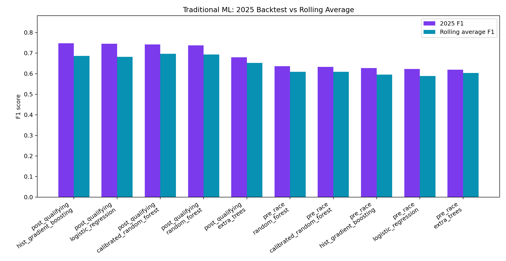

Compares each traditional ML model's 2025 F1 score with its 2022-2025 rolling average F1 score, showing whether the model is stable across seasons.

Use in report: robustness and generalization evaluation.

#### [`figures/advanced_podium_model_comparison.png`](figures/advanced_podium_model_comparison.png)

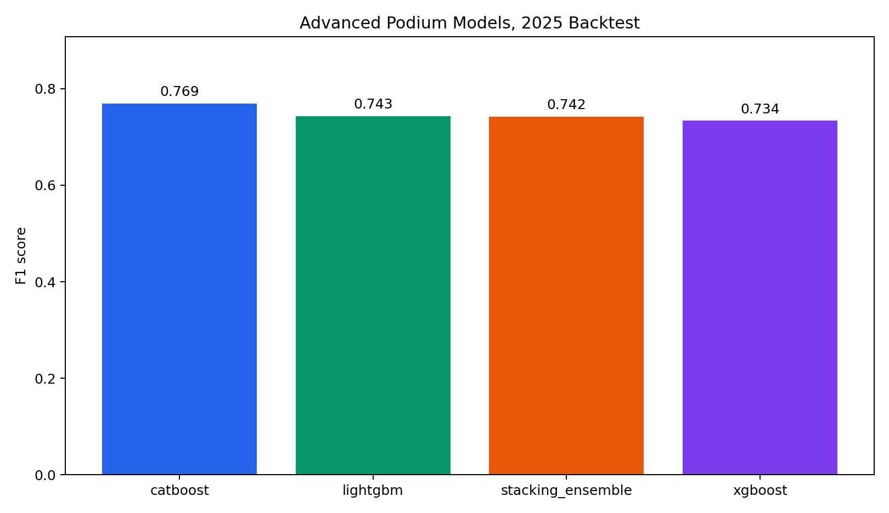

Compares advanced podium models such as CatBoost, LightGBM, XGBoost, and the stacking ensemble using 2025 F1 score.

Use in report: advanced model comparison.

#### [`figures/podium_ranking_metrics_2025.png`](figures/podium_ranking_metrics_2025.png)

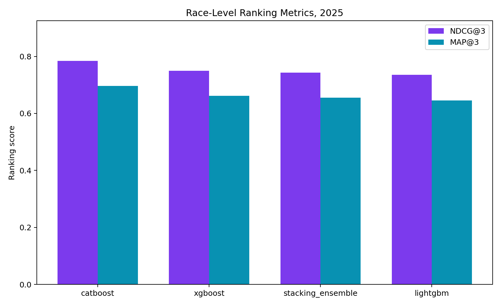

Shows race-level ranking metrics such as NDCG@3 and MAP@3. These metrics evaluate whether a model ranks true podium drivers near the top within each race.

Use in report: race-level ranking evaluation.

#### [`figures/podium_advanced_ranking_metrics_all.png`](figures/podium_advanced_ranking_metrics_all.png)

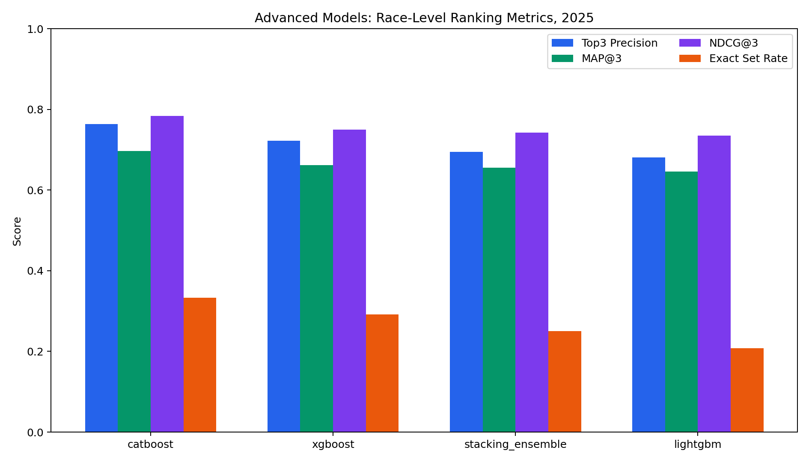

Compares Top3 Precision, MAP@3, NDCG@3, and exact podium-set hit rate for CatBoost, LightGBM, XGBoost, and the stacking ensemble. It focuses on whether the model can rank podium candidates correctly within each race.

Use in report: advanced ranking model evaluation.

#### [`figures/podium_model_composite_score.png`](figures/podium_model_composite_score.png)

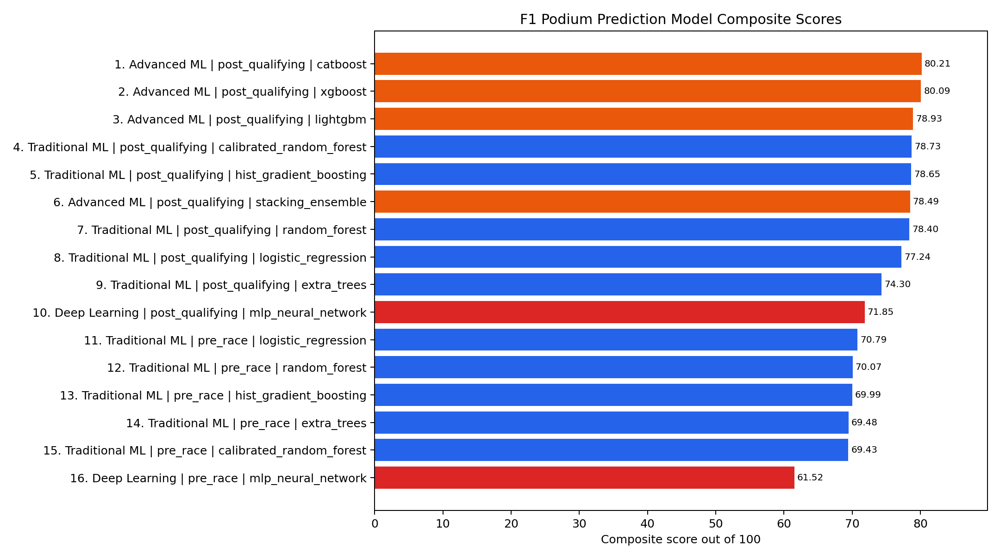

Ranks all traditional ML, advanced ML, and deep-learning podium models using one weighted 0-100 composite score. The score uses common metrics across all model families: F1, ROC-AUC, race-level Top3 Precision, Precision, and Recall.

Use in report: final model selection and overall model evaluation.

#### [`figures/top10_model_comparison_2025.png`](figures/top10_model_comparison_2025.png)

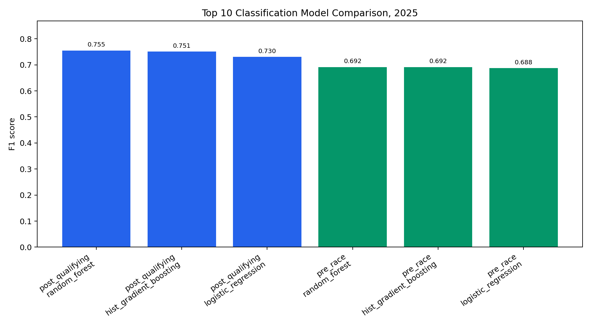

Compares 2025 F1 scores for Top 10 classification models, including traditional ML, advanced boosting, MLP, and TabNet classifiers. This extends the project from podium-only prediction to points-zone prediction.

Use in report: championship-simulation preparation.

#### [`figures/points_model_comparison_2025.png`](figures/points_model_comparison_2025.png)

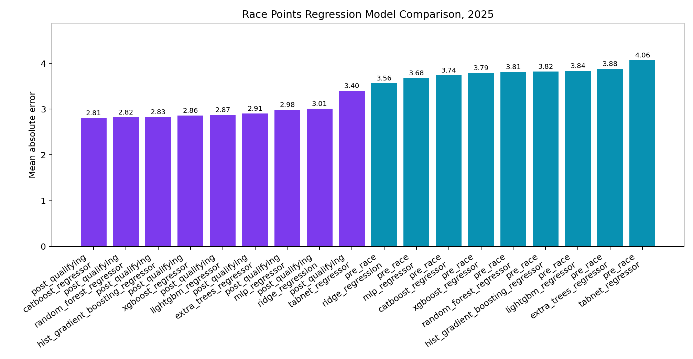

Compares mean absolute error for race-points regression models, including traditional ML, advanced boosting, MLP, and TabNet regressors. Lower values indicate better predicted single-race points, which are needed for season-level standings simulation.

Use in report: expected-points model evaluation.

#### [`figures/points_actual_vs_predicted_2025.png`](figures/points_actual_vs_predicted_2025.png)

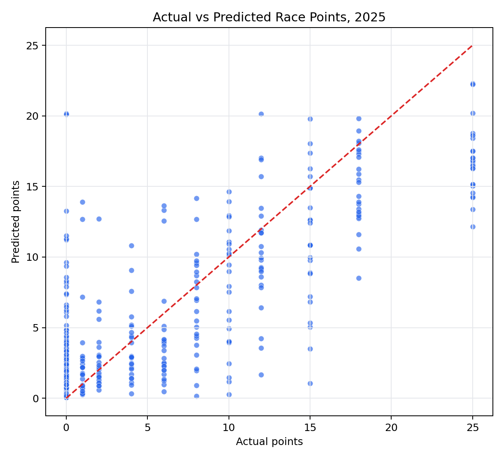

Shows actual current-rule race points versus predicted race points for the selected 2025 model. The diagonal line indicates perfect prediction.

Use in report: regression model diagnostic.

#### [`figures/top10_race_level_precision_2025.png`](figures/top10_race_level_precision_2025.png)

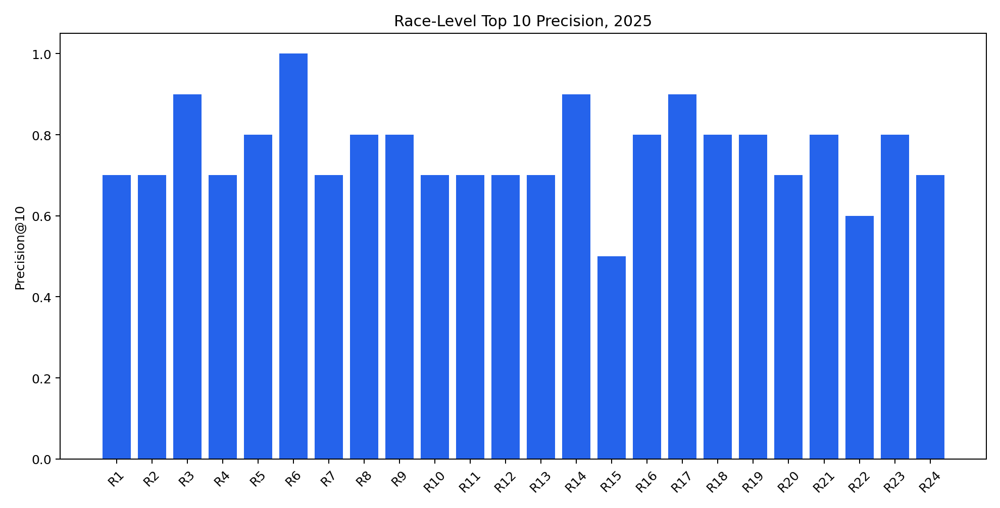

Shows Precision@10 for each 2025 race after selecting the ten drivers with the highest predicted Top 10 probabilities. This evaluates the model in a race-level way rather than only as independent binary rows.

Use in report: race-level Top 10 evaluation.

#### [`figures/points_error_by_points_bin_2025.png`](figures/points_error_by_points_bin_2025.png)

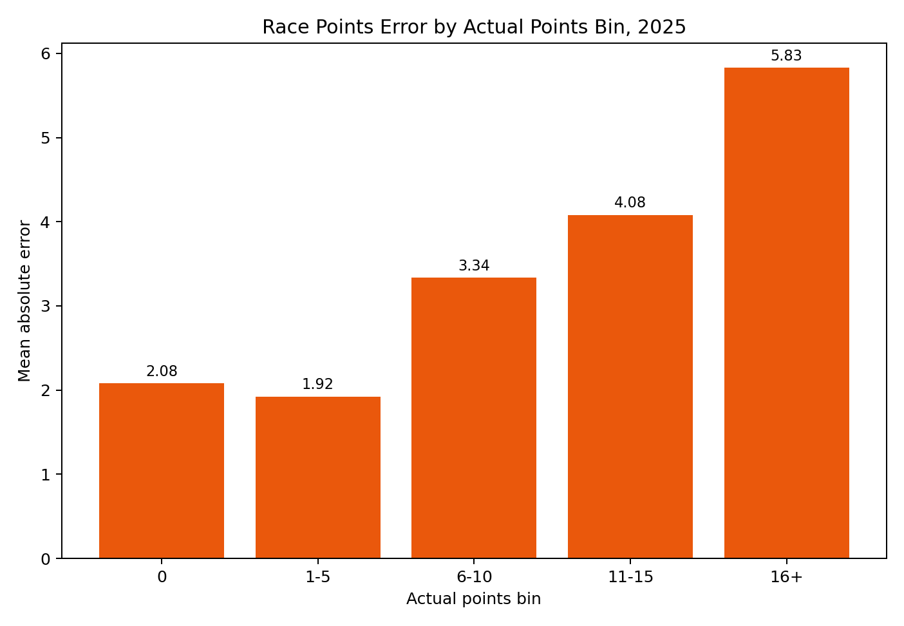

Shows points-regression MAE grouped by actual current-rule points bins. It reveals whether the model performs differently for non-scoring drivers, low scorers, and high scorers.

Use in report: regression error diagnosis.

#### [`figures/top10_calibration_curve_2025.png`](figures/top10_calibration_curve_2025.png)

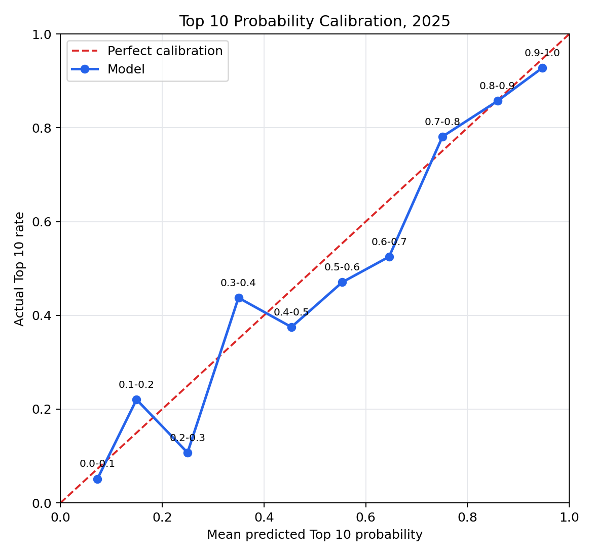

Compares predicted Top 10 probabilities with actual Top 10 rates in probability bins. It checks whether a predicted probability such as 0.8 behaves like an 80% event in real 2025 race data.

Use in report: probability calibration and model reliability diagnosis.

#### [`figures/points_rule_mapped_comparison_2025.png`](figures/points_rule_mapped_comparison_2025.png)

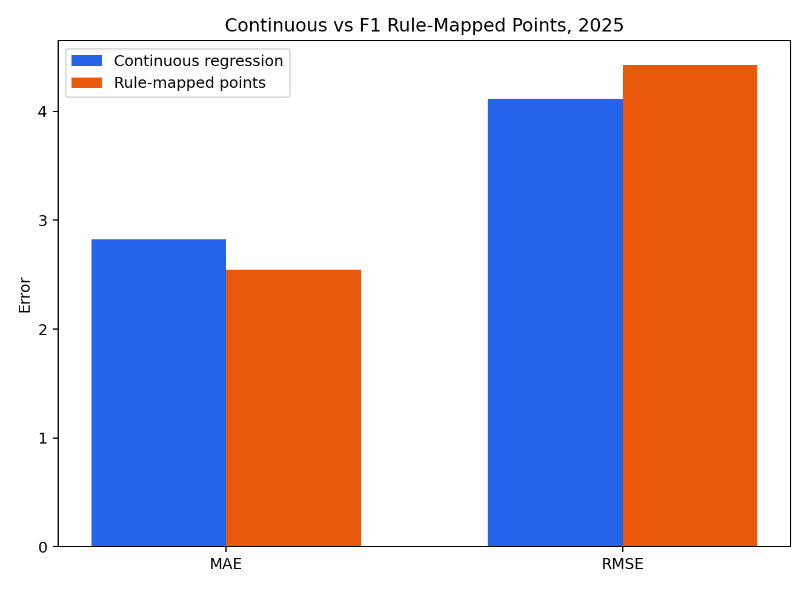

Compares continuous predicted race points with points mapped through the official F1 race-points table. This shows whether converting model rankings into real F1 scoring rules improves season-simulation realism.

Use in report: F1 points-rule post-processing and championship-simulation preparation.

#### [`figures/points_race_level_error_2025.png`](figures/points_race_level_error_2025.png)

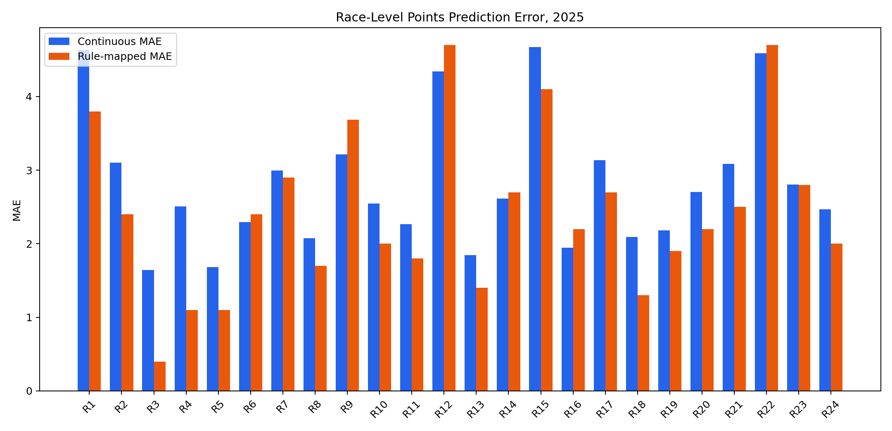

Shows continuous and rule-mapped points MAE for each 2025 race. It identifies which races are easier or harder for the points model to predict.

Use in report: race-level prediction-quality diagnosis.

#### [`figures/top10_points_rolling_backtest.png`](figures/top10_points_rolling_backtest.png)

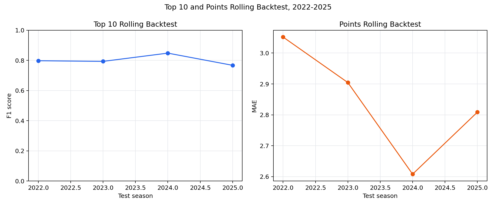

Shows rolling backtest performance from 2022 to 2025 for compact, efficient Top 10 and race-points model choices. The Top 10 rolling model is LightGBM for runtime stability, while the final single-season Top 10 best model can still be TabNet.

Use in report: model robustness and temporal validation.

#### [`figures/points_correction_experiment_2025.png`](figures/points_correction_experiment_2025.png)

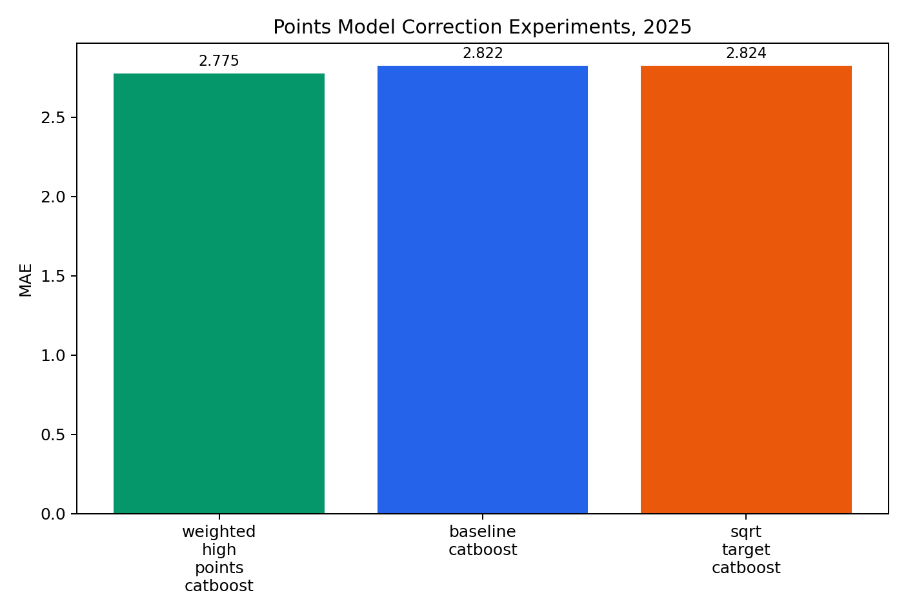

Compares the baseline CatBoost points model with simple correction experiments for high-score underestimation, including high-points sample weighting and square-root target transformation.

Use in report: model-improvement experiment and limitation discussion.

#### [`figures/top10_feature_importance.png`](figures/top10_feature_importance.png)

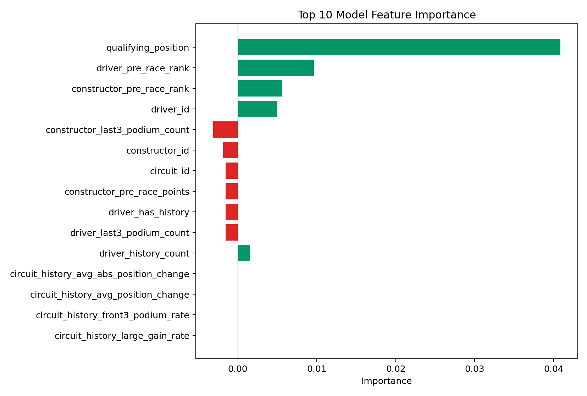

Shows the most important features used by the best Top 10 model. It helps explain which factors drive points-zone predictions.

Use in report: Top 10 model interpretation.

#### [`figures/points_feature_importance.png`](figures/points_feature_importance.png)

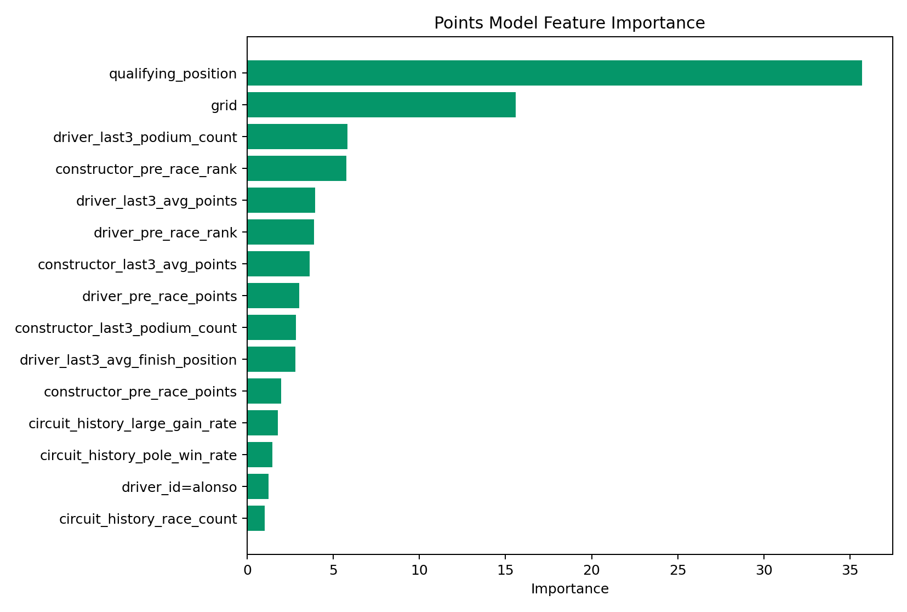

Shows the most important features used by the best race-points model. It helps explain which factors affect predicted single-race points.

Use in report: points model interpretation.

#### [`figures/rule_mapped_strategy_comparison_2025.png`](figures/rule_mapped_strategy_comparison_2025.png)

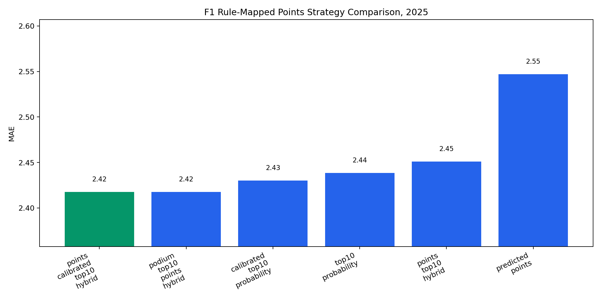

Compares multiple race-level ranking strategies after assigning the official F1 points table. The best 2025 backtest strategy combines normalized predicted points with leave-one-race-out calibrated Top 10 probability.

Use in report: F1 scoring-rule post-processing and model selection for season simulation.

#### [`figures/top10_calibrated_probability_curve_2025.png`](figures/top10_calibrated_probability_curve_2025.png)

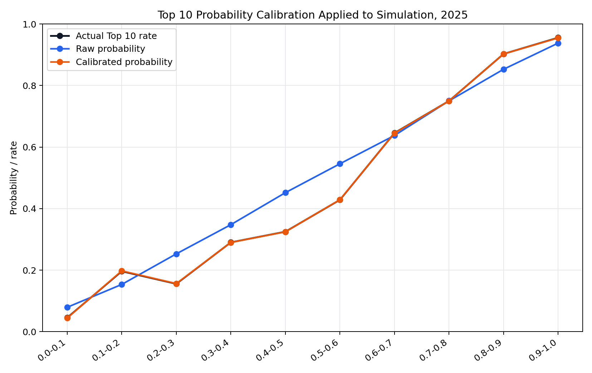

Compares raw Top 10 probabilities, calibrated Top 10 probabilities, and actual Top 10 rates. Calibration uses a leave-one-race-out empirical mapping, so each race is calibrated without using its own labels.

Use in report: probability calibration before season-level simulation.

#### [`figures/season_simulation_driver_uncertainty_2025.png`](figures/season_simulation_driver_uncertainty_2025.png)

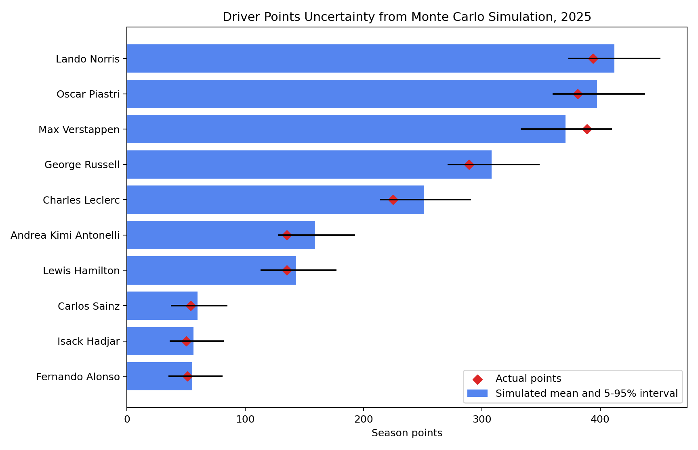

Shows Monte Carlo simulated driver points with 5-95% uncertainty intervals and actual 2025 points. It demonstrates how model outputs can become a probabilistic season standings forecast.

Use in report: uncertainty modeling and championship-prediction preparation.

#### [`figures/season_simulation_constructor_uncertainty_2025.png`](figures/season_simulation_constructor_uncertainty_2025.png)

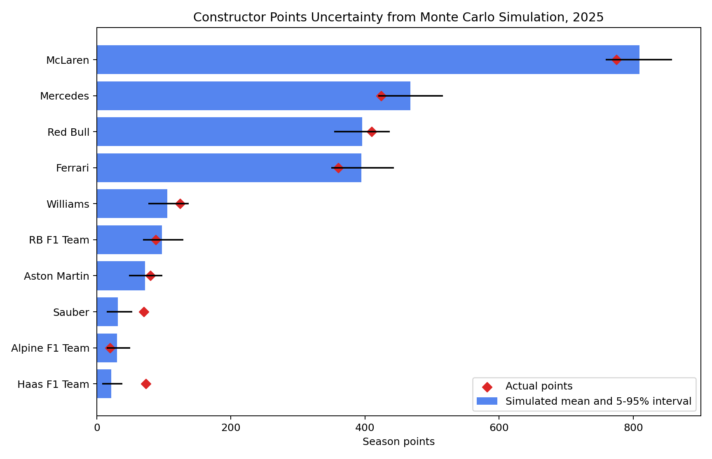

Shows Monte Carlo simulated constructor points with uncertainty intervals and actual 2025 points. It provides the constructor-level version of the season simulation backtest.

Use in report: constructor championship uncertainty analysis.

#### [`figures/season_simulation_champion_probabilities_2025.png`](figures/season_simulation_champion_probabilities_2025.png)

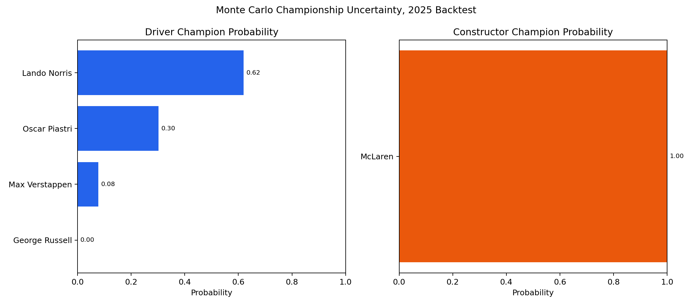

Shows driver and constructor champion probabilities from the Monte Carlo 2025 backtest. This is not the final 2026 prediction; it validates the method that will later be used for 2026.

Use in report: probabilistic championship prediction method.

#### [`figures/season_prediction_driver_champion_2026.png`](figures/season_prediction_driver_champion_2026.png)

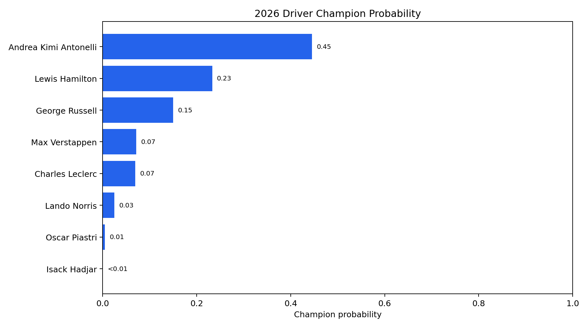

Shows the final 2026 driver champion probabilities from the pre-race championship simulation. Completed 2026 races use real standings as the starting point, while remaining races are simulated with pre-race model signals and F1 rule-mapped points.

Use in report: final 2026 driver championship prediction.

#### [`figures/season_prediction_constructor_champion_2026.png`](figures/season_prediction_constructor_champion_2026.png)

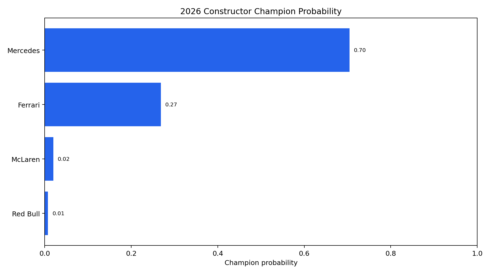

Shows the final 2026 constructor champion probabilities from the same championship simulation process. It aggregates simulated driver race points into constructor standings.

Use in report: final 2026 constructor championship prediction.

#### [`figures/season_prediction_driver_points_uncertainty_2026.png`](figures/season_prediction_driver_points_uncertainty_2026.png)

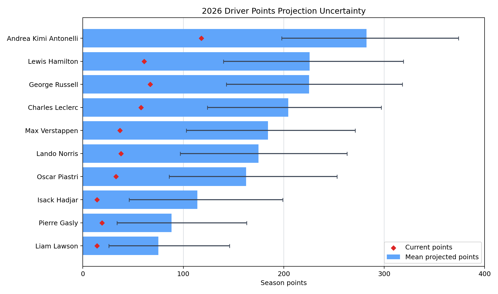

Shows projected 2026 driver points with 5-95% uncertainty intervals and current points. It explains not only who is most likely to win, but also how uncertain each driver's final score is.

Use in report: final driver standings uncertainty analysis.

#### [`figures/season_prediction_constructor_points_uncertainty_2026.png`](figures/season_prediction_constructor_points_uncertainty_2026.png)

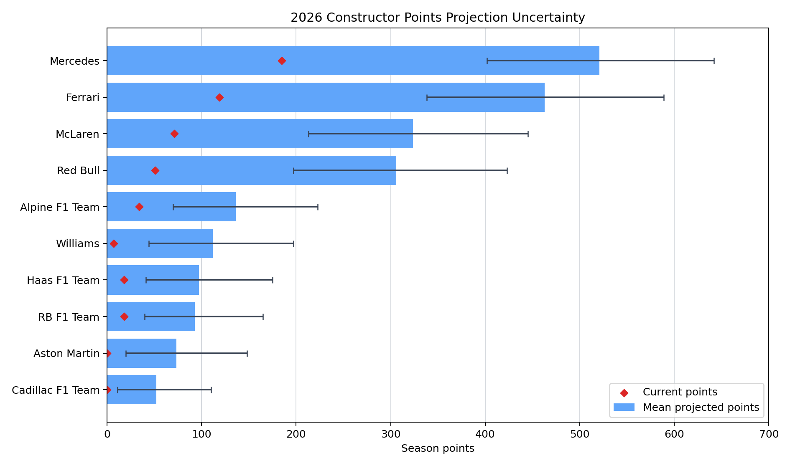

Shows projected 2026 constructor points with uncertainty intervals and current points. It is the constructor-level counterpart of the driver points uncertainty figure.

Use in report: final constructor standings uncertainty analysis.
